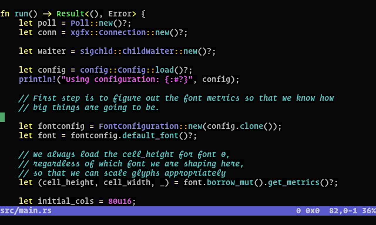

# Wez's Terminal

A terminal emulator implemented in Rust, using OpenGL ES 2 for rendering.

[](https://travis-ci.org/wez/wezterm)
[](https://codecov.io/gh/wez/wezterm)




*Screenshot of wezterm on X11, running vim*

## Quickstart

* Install `rustup` to get the *nightly* `rust` compiler installed on your system.
  https://www.rust-lang.org/en-US/install.html
* Build in release mode: `rustup run nightly cargo build --release`
* Run it via either `rustup run nightly cargo run --release` or `target/release/wezterm`

You will need a collection of support libraries; the [`get-deps`](get-deps) script will
attempt to install them for you.  If it doesn't know about your system,
[please contribute instructions!](CONTRIBUTING.md)

```
$ curl https://sh.rustup.rs -sSf | sh -s -- --default-toolchain nightly
$ git clone --depth=1 --branch=master https://github.com/wez/wezterm.git
$ cd wezterm
$ sudo ./get-deps
$ rustup run nightly cargo build --release
$ rustup run nightly cargo run --release
```

## What?

Here's what I'm shooting for:

* A terminal escape sequence parser
* A model of a terminal screen + scrollback that is OS independent
* Textual and GUI rendering of the model
* A differential protocol for the model

This would manifest as a common core that could run as both a textual
terminal multiplexer and a gui terminal emulator, where the GUI part
could automatically provide a native UI around the remotely multiplexed
terminal session.

## Status / Features - Alpha Quality

*There may be bugs that cause the terminal to panic. I'd recommend using
`tmux` or `screen` to keep your session alive if you are working on something important!*

Despite the warning above, I've been using `wezterm` as my daily driver since
the middle of Feb 2018.  The following features are done:

- [x] Runs on Linux under X (requires OpenGL ES 2)
- [x] Scrollback (use mouse wheel and Shift Page{Up|Down})
- [x] True Color support
- [x] Ligatures, Color Emoji and font fallback
- [x] xterm style selection of text with mouse; paste selection via Shift-Insert (bracketed paste is supported!)
- [x] SGR style mouse reporting (works in vim and tmux)
- [x] Render underline, double-underline, italic, bold, strikethrough
- [x] Configuration file to specify fonts and colors
- [x] Hyperlinks per: https://gist.github.com/egmontkob/eb114294efbcd5adb1944c9f3cb5feda
- [x] Multiple Windows (Hotkey: `Alt-Y` but I don't like it) and Tabs (Hotkey: `Super-T`, next/prev: `Super-[` and `Super-]`, go-to: `Super-[0-9]`)

There's a good number of terminal escape sequences that are not yet implemented
and that will get fleshed out as the applications I use uncover them, or as folks
report them here and raise the priority.  Similarly for key mappings.  Please don't
be shy about [contributing support for missing things!](CONTRIBUTING.md)

Things that I'd like to see happen and that have no immediate priority;
[contributions to get closer to these are welcomed!](CONTRIBUTING.md)

- [ ] Run on macOS
- [ ] Sixel / iTerm2 graphics protocol support
- [ ] Textual renderer.  Think `tmux` or `screen`.
- [ ] Run on Linux with Wayland (use XWayland for now; See https://github.com/tomaka/winit/issues/306 for upstream blockers)
- [ ] Run on Windows


## Configuration

`wezterm` will look for a TOML configuration file in `$HOME/.config/wezterm/wezterm.toml`,
and then in `$HOME/.wezterm.toml`.

Configuration is currently very simple and the format is considered unstable and subject
to change.  The code for configuration can be found in [`src/config.rs`](src/config.rs).

I use the following in my `~/.wezterm.toml`:

```
font_size = 10
font = { fontconfig_pattern = "Operator Mono SSm Lig Medium" }
# How many lines of scrollback to retain
scrollback_lines = 3500

[[font_rules]]
italic = true
font = { fontconfig_pattern = "Operator Mono SSm Lig Medium:style=Italic" }

[[font_rules]]
italic = true
intensity = "Bold"
font = { fontconfig_pattern = "Operator Mono SSm Lig:style=Italic:weight=bold" }

[[font_rules]]
intensity = "Bold"
  [font_rules.font]
  fontconfig_pattern= "Operator Mono SSm:weight=bold"
  # if you liked xterm's `boldColor` setting, this is how you do it in wezterm,
  # but you can apply it to any set of matching attributes!
  foreground = "tomato"

[[font_rules]]
intensity = "Half"
font = { fontconfig_pattern = "Operator Mono SSm Lig Light" }
```

The default configuration will attempt to use whichever font is returned from
fontconfig when `monospace` is requested.

### Colors

You can configure colors with a section like this.  In addition to specifying
SVG/CSS3 color names, you can use `#RRGGBB` to specify a color code using the
usual hex notation; eg: `#000000` is equivalent to `black`:

```
[colors]
foreground = "silver"
background = "black"
cursor_bg = "springgreen"
ansi = ["black", "maroon", "green", "olive", "navy", "purple", "teal", "silver"]
brights = ["grey", "red", "lime", "yellow", "blue", "fuchsia", "aqua", "white"]
```

## Performance

While ultimate speed is not the main goal, performance is important!
Using the GPU to render the terminal contents helps keep CPU usage down
and the output feeling snappy.

Here's a very basic benchmark:

```
$ find /usr > /tmp/usr-files.txt
$ wc -l /tmp/usr-files.txt
364885 /tmp/usr-files.txt
$ time cat /tmp/usr-files.txt
```

And a comparison between some terminal emulators on my system; they were each
set to 80x24 with 3500 lines of scrollback.  `alacritty` has no scrollback.

| Terminal        | Time (seconds) |
|-----------------|-------|
| xterm           | 9.863 |
| Gnome Terminal  | 2.391 |
| Terminator 1.91 | 2.319 |
| **wezterm**     | 0.940 |
| kitty           | 0.899 |
| urxvt           | 0.615 |
| alacritty       | 0.421 |

## Getting help

This is a spare time project, so please bear with me.  There are two channels for support:

* You can use the GitHub issue tracker to see if someone else has a similar issue, or to file a new one: https://github.com/wez/wezterm/issues
* There is a gitter room for (potentially!) real time discussions: https://gitter.im/wezterm/Lobby

The gitter room is probably better suited to questions than it is to bug reports, but don't be afraid to use whichever you are most comfortable using and we'll work it out.


