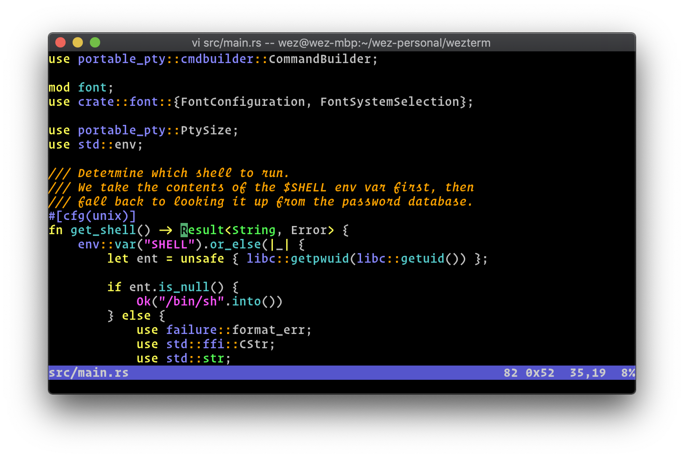

# Wez's Terminal

 *A GPU-accelerated cross-platform terminal emulator and multiplexer written by <a href="https://github.com/wez">@wez</a> and implemented in <a href="https://www.rust-lang.org/">Rust</a>*

User facing docs and guide at: https://wezterm.org/

*Screenshot of wezterm on macOS, running vim*

## Installation

https://wezterm.org/installation

## Getting help

This is a spare time project, so please bear with me.  There are a couple of channels for support:

* You can use the [GitHub issue tracker](https://github.com/wezterm/wezterm/issues) to see if someone else has a similar issue, or to file a new one.
* Start or join a thread in our [GitHub Discussions](https://github.com/wezterm/wezterm/discussions); if you have general
  questions or want to chat with other wezterm users, you're welcome here!
* There is a [Matrix room via Element.io](https://app.element.io/#/room/#wezterm:matrix.org)
  for (potentially!) real time discussions.

The GitHub Discussions and Element/Gitter rooms are better suited for questions
than bug reports, but don't be afraid to use whichever you are most comfortable
using and we'll work it out.

## Supporting the Project

If you use and like WezTerm, please consider sponsoring it: your support helps
to cover the fees required to maintain the project and to validate the time
spent working on it!

[Read more about sponsoring](https://wezterm.org/sponsor.html).

* 
* [Patreon](https://patreon.com/WezFurlong)
* [Ko-Fi](https://ko-fi.com/wezfurlong)
* [Liberapay](https://liberapay.com/wez)
