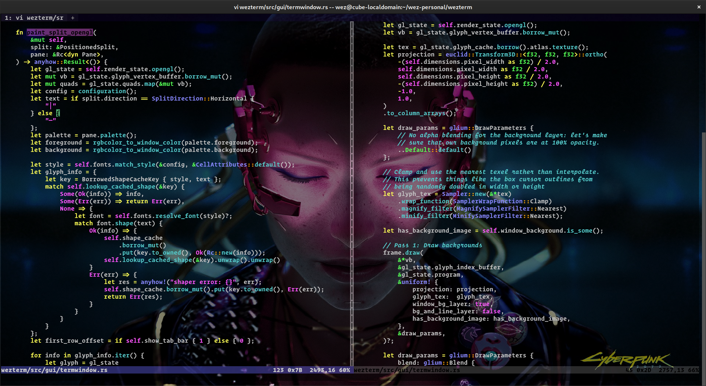
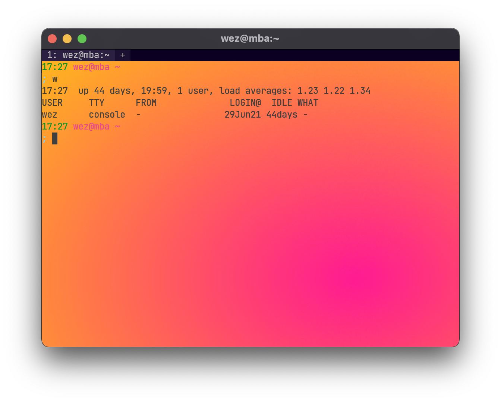

### Color Scheme

WezTerm ships with over 700 color schemes available from
[iTerm2-Color-Schemes](https://github.com/mbadolato/iTerm2-Color-Schemes#screenshots),
[base16](https://github.com/chriskempson/base16-schemes-source),
[Gogh](https://gogh-co.github.io/Gogh/) and
[terminal.sexy](https://terminal.sexy/) and a couple of other locations.

You can select a color scheme with a line like this:

```lua
local wezterm = require 'wezterm'
local config = {}

config.color_scheme = 'Batman'

return config
```

You can find a list of available color schemes and screenshots
in [The Color Schemes Section](../colorschemes/index.md).

If you'd like to automatically adjust your color scheme based on the
system dark mode or light mode appearance, see the example in
[wezterm.gui.get_appearance()](lua/wezterm.gui/get_appearance.md)

!!! note
    if you are using multiplexing with ssh or tls domains, the color scheme
    is controlled by the config file on the multiplexer server side. This is
    because the palette is an attribute of the terminal emulation and that state
    lives on the multiplexer server.*

### Precedence of `colors` vs `color_schemes`

The `color_scheme` option takes precedence over the `colors` section below,
and is mutually exclusive with it. If you want to merge/override colors
you need to use [wezterm.color.get_default_colors()](lua/wezterm.color/get_default_colors.md) and explicitly merge them.

{{since('20220903-194523-3bb1ed61')}}

The behavior has been changed so that the `color_scheme` you have selected, if
any, is used to define the colors, and then any colors you define in the
`colors` section will override those colors.

### Defining your own colors

You can specify the color palette using the `colors` configuration section.

You can configure colors with a section like this.  In addition to specifying
[SVG/CSS3 color names](https://docs.rs/palette/0.4.1/palette/named/index.html#constants),
you can use `#RRGGBB` to specify a color code using the
usual hex notation; eg: `#000000` is equivalent to `black`:

```lua
local wezterm = require 'wezterm'
local config = {}

config.colors = {
  -- The default text color
  foreground = 'silver',
  -- The default background color
  background = 'black',

  -- Overrides the cell background color when the current cell is occupied by the
  -- cursor and the cursor style is set to Block
  cursor_bg = '#52ad70',
  -- Overrides the text color when the current cell is occupied by the cursor
  cursor_fg = 'black',
  -- Specifies the border color of the cursor when the cursor style is set to Block,
  -- or the color of the vertical or horizontal bar when the cursor style is set to
  -- Bar or Underline.
  cursor_border = '#52ad70',

  -- the foreground color of selected text
  selection_fg = 'black',
  -- the background color of selected text
  selection_bg = '#fffacd',

  -- The color of the scrollbar "thumb"; the portion that represents the current viewport
  scrollbar_thumb = '#222222',

  -- The color of the split lines between panes
  split = '#444444',

  ansi = {
    'black',
    'maroon',
    'green',
    'olive',
    'navy',
    'purple',
    'teal',
    'silver',
  },
  brights = {
    'grey',
    'red',
    'lime',
    'yellow',
    'blue',
    'fuchsia',
    'aqua',
    'white',
  },

  -- Arbitrary colors of the palette in the range from 16 to 255
  indexed = { [136] = '#af8700' },

  -- Since: 20220319-142410-0fcdea07
  -- When the IME, a dead key or a leader key are being processed and are effectively
  -- holding input pending the result of input composition, change the cursor
  -- to this color to give a visual cue about the compose state.
  compose_cursor = 'orange',

  -- Colors for copy_mode and quick_select
  -- available since: 20220807-113146-c2fee766
  -- In copy_mode, the color of the active text is:
  -- 1. copy_mode_active_highlight_* if additional text was selected using the mouse
  -- 2. selection_* otherwise
  copy_mode_active_highlight_bg = { Color = '#000000' },
  -- use `AnsiColor` to specify one of the ansi color palette values
  -- (index 0-15) using one of the names "Black", "Maroon", "Green",
  --  "Olive", "Navy", "Purple", "Teal", "Silver", "Grey", "Red", "Lime",
  -- "Yellow", "Blue", "Fuchsia", "Aqua" or "White".
  copy_mode_active_highlight_fg = { AnsiColor = 'Black' },
  copy_mode_inactive_highlight_bg = { Color = '#52ad70' },
  copy_mode_inactive_highlight_fg = { AnsiColor = 'White' },

  quick_select_label_bg = { Color = 'peru' },
  quick_select_label_fg = { Color = '#ffffff' },
  quick_select_match_bg = { AnsiColor = 'Navy' },
  quick_select_match_fg = { Color = '#ffffff' },
}

return config
```

{{since('20220101-133340-7edc5b5a')}}

You may specify colors in the HSL color space, if you prefer that over RGB, by using:

```lua
config.colors = {
  -- the first number is the hue measured in degrees with a range
  -- of 0-360.
  -- The second number is the saturation measured in percentage with
  -- a range of 0-100.
  -- The third number is the lightness measured in percentage with
  -- a range of 0-100.
  foreground = 'hsl:235 100 50',
}
```

{{since('20220319-142410-0fcdea07')}}

Colors now also accept the following CSS-style color specifications:

```
rgb(0,255,0)
rgb(0% 100% 0%)
rgb(0 255 0 / 100%)
rgba(0,255,0,1)
hsl(120,100%,50%)
hsl(120deg 100% 50%)
hsl(-240 100% 50%)
hsl(-240deg 100% 50%)
hsl(0.3333turn 100% 50%)
hsl(133.333grad 100% 50%)
hsl(2.0944rad 100% 50%)
hsla(120,100%,50%,100%)
hwb(120 0% 0%)
hwb(480deg 0% 0% / 100%)
hsv(120,100%,100%)
hsv(120deg 100% 100% / 100%)
```

The alpha value is ignored except when used with `selection_fg` and
`selection_bg`:

```lua
config.colors = {
  -- Make the selection text color fully transparent.
  -- When fully transparent, the current text color will be used.
  selection_fg = 'none',
  -- Set the selection background color with alpha.
  -- When selection_bg is transparent, it will be alpha blended over
  -- the current cell background color, rather than replace it
  selection_bg = 'rgba(50% 50% 50% 50%)',
}
```

### Defining a Color Scheme in your `.wezterm.lua`

If you'd like to keep a couple of color schemes handy in your configuration
file, rather than filling out the `colors` section, place it in a
`color_schemes` section as shown below; you can then reference it using the
`color_scheme` setting.

Color schemes names that you define in your `wezterm.lua` take precedence
over all other color schemes.

All of the settings available from the `colors` section are available
to use in the `color_schemes` sections.

```lua
config.color_scheme = 'Red Scheme'

config.color_schemes = {
  ['Red Scheme'] = {
    background = 'red',
  },
  ['Blue Scheme'] = {
    background = 'blue',
  },
}
```

See also [wezterm.get_builtin_color_schemes()](lua/wezterm/get_builtin_color_schemes.md) for
some more advanced examples, such as picking a random color scheme, or deriving from a
builting color scheme.

### Defining a Color Scheme in a separate file

If you'd like to factor your color schemes out into separate files, you
can create a [TOML format](https://toml.io/en/) file with a `[colors]` section; take a look at [one of
the available color schemes for an example](https://github.com/wezterm/wezterm/tree/main/config/src/scheme_data.rs).

It is recommended that you place your custom scheme in a directory
named `$HOME/.config/wezterm/colors` if you're on a POSIX system.

On a Windows system, `wezterm` will search for schemes in a directory
named `colors` that is in the same directory as the `wezterm.exe`.

If you wish to place your color scheme files in some other location, then you
will need to instruct wezterm where to look for your scheme files; the
`color_scheme_dirs` setting specifies a list of directories to be searched:

```lua
config.color_scheme_dirs = { '/some/path/to/my/color/schemes' }
```

Color scheme names that are defined in files in your `color_scheme_dirs` list
take precedence over the built-in color schemes.

### Dynamic Color Escape Sequences

Wezterm supports dynamically changing its color palette via escape sequences.

[The dynamic-colors directory](https://github.com/mbadolato/iTerm2-Color-Schemes/tree/master/dynamic-colors)
of the color scheme repo contains shell scripts that can change the color
scheme immediately on the fly.  This can be used in your own scripts to alter
the terminal appearance programmatically:

```console
$ git clone https://github.com/mbadolato/iTerm2-Color-Schemes.git
$ cd iTerm2-Color-Schemes/dynamic-colors
$ for scheme in *.sh ; do ; echo $scheme ; \
   bash "$scheme" ; ../tools/screenshotTable.sh; sleep 0.5; done
```

  <video width="80%" controls src="../screenshots/wezterm-dynamic-colors.mp4" loop></video>

### Tab Bar Appearance & Colors

The tab bar has two modes; the default is a native looking style, but
it is also possible to enable a retro aesthetic.  The configuration
for the two styles is broadly similar, but there are a few different
details.

* [use_fancy_tab_bar](lua/config/use_fancy_tab_bar.md) option controls
  which tab bar style is used.
* [enable_tab_bar](lua/config/enable_tab_bar.md) option control
  whether the tab bar is used at all.
* [hide_tab_bar_if_only_one_tab](lua/config/hide_tab_bar_if_only_one_tab.md) option
  causes the tab bar to be hidden when there is only a single tab.
* [tab_bar_at_bottom](lua/config/tab_bar_at_bottom.md) places the tab
  bar at the bottom of the window instead of the top
* [tab_max_width](lua/config/tab_max_width.md) sets the maximum width, measured in cells,
  of a given tab when using retro tab mode.

#### Native (Fancy) Tab Bar appearance

The following options affect the fancy tab bar:

```lua
config.window_frame = {
  -- The font used in the tab bar.
  -- Roboto Bold is the default; this font is bundled
  -- with wezterm.
  -- Whatever font is selected here, it will have the
  -- main font setting appended to it to pick up any
  -- fallback fonts you may have used there.
  font = wezterm.font { family = 'Roboto', weight = 'Bold' },

  -- The size of the font in the tab bar.
  -- Default to 10.0 on Windows but 12.0 on other systems
  font_size = 12.0,

  -- The overall background color of the tab bar when
  -- the window is focused
  active_titlebar_bg = '#333333',

  -- The overall background color of the tab bar when
  -- the window is not focused
  inactive_titlebar_bg = '#333333',
}

config.colors = {
  tab_bar = {
    -- The color of the inactive tab bar edge/divider
    inactive_tab_edge = '#575757',
  },
}
```

In addition, the tab bar colors mentioned below also apply
to the items displayed in the tab bar.

#### Retro Tab Bar appearance

The following options control the appearance of the tab bar:

```lua
config.colors = {
  tab_bar = {
    -- The color of the strip that goes along the top of the window
    -- (does not apply when fancy tab bar is in use)
    background = '#0b0022',

    -- The active tab is the one that has focus in the window
    active_tab = {
      -- The color of the background area for the tab
      bg_color = '#2b2042',
      -- The color of the text for the tab
      fg_color = '#c0c0c0',

      -- Specify whether you want "Half", "Normal" or "Bold" intensity for the
      -- label shown for this tab.
      -- The default is "Normal"
      intensity = 'Normal',

      -- Specify whether you want "None", "Single" or "Double" underline for
      -- label shown for this tab.
      -- The default is "None"
      underline = 'None',

      -- Specify whether you want the text to be italic (true) or not (false)
      -- for this tab.  The default is false.
      italic = false,

      -- Specify whether you want the text to be rendered with strikethrough (true)
      -- or not for this tab.  The default is false.
      strikethrough = false,
    },

    -- Inactive tabs are the tabs that do not have focus
    inactive_tab = {
      bg_color = '#1b1032',
      fg_color = '#808080',

      -- The same options that were listed under the `active_tab` section above
      -- can also be used for `inactive_tab`.
    },

    -- You can configure some alternate styling when the mouse pointer
    -- moves over inactive tabs
    inactive_tab_hover = {
      bg_color = '#3b3052',
      fg_color = '#909090',
      italic = true,

      -- The same options that were listed under the `active_tab` section above
      -- can also be used for `inactive_tab_hover`.
    },

    -- The new tab button that let you create new tabs
    new_tab = {
      bg_color = '#1b1032',
      fg_color = '#808080',

      -- The same options that were listed under the `active_tab` section above
      -- can also be used for `new_tab`.
    },

    -- You can configure some alternate styling when the mouse pointer
    -- moves over the new tab button
    new_tab_hover = {
      bg_color = '#3b3052',
      fg_color = '#909090',
      italic = true,

      -- The same options that were listed under the `active_tab` section above
      -- can also be used for `new_tab_hover`.
    },
  },
}
```

### Window Padding

You may add padding around the edges of the terminal area.

[See the window_padding docs for more info](lua/config/window_padding.md)

## Styling Inactive Panes

{{since('20201031-154415-9614e117')}}

To make it easier to see which pane is active, the inactive panes are dimmed
and de-saturated slightly.

You can specify your own transformation to the pane colors with a hue,
saturation, brightness (HSB) multiplier.

In this example, inactive panes will be slightly de-saturated and dimmed;
this is the default configuration:

```lua
config.inactive_pane_hsb = {
  saturation = 0.9,
  brightness = 0.8,
}
```

The transform works by converting the RGB colors to HSV values and
then multiplying the HSV by the numbers specified in `inactive_pane_hsb`.

Modifying the hue changes the hue of the color by rotating it through the color
wheel. It is not as useful as the other components, but is available "for free"
as part of the colorspace conversion.

Modifying the saturation can add or reduce the amount of "colorfulness". Making
the value smaller can make it appear more washed out.

Modifying the brightness can be used to dim or increase the perceived amount of
light.

The range of these values is 0.0 and up; they are used to multiply the existing
values, so the default of 1.0 preserves the existing component, whilst 0.5 will
reduce it by half, and 2.0 will double the value.

## Window Background Image



{{since('20201031-154415-9614e117')}}

You can attach an image to the background of the wezterm window:

```lua
config.window_background_image = '/path/to/wallpaper.jpg'
```

If the path is a relative path then it will be expanded relative
to the directory containing your `wezterm.lua` config file.

PNG, JPEG, GIF, BMP, ICO, TIFF, PNM, DDS, TGA and farbfeld files
can be loaded.  Animated GIF and PNG files will animate while
the window has focus.

The image will be scaled to fit the window contents.  Very large
images may decrease render performance and take up VRAM from the
GPU, so you may wish to resize the image file before using it.

You can optionally transform the background image by specifying
a hue, saturation, brightness multiplier:

```lua
config.window_background_image = '/path/to/wallpaper.jpg'

config.window_background_image_hsb = {
  -- Darken the background image by reducing it to 1/3rd
  brightness = 0.3,

  -- You can adjust the hue by scaling its value.
  -- a multiplier of 1.0 leaves the value unchanged.
  hue = 1.0,

  -- You can adjust the saturation also.
  saturation = 1.0,
}
```

See [Styling Inactive Panes](#styling-inactive-panes) for more information
on hue, saturation, brightness transformations.

If you'd like to have control over scaling, tiling/repeating, scrolling
behavior and more, take a look at the more powerful
[background](lua/config/background.md) configuration option.

## Window Background Gradient

{{since('20210814-124438-54e29167')}}



See [window_background_gradient](lua/config/window_background_gradient.md)
for configuration information on gradients.

## Window Background Opacity

{{since('20201031-154415-9614e117')}}

If your Operating System provides Compositing support then WezTerm is able to
specify the alpha channel value for the background content, rendering the
window background translucent (some refer to this as transparent rather than
translucent) and causing the windows/desktop behind it to show through the
window.

macOS, Windows and Wayland support compositing out of the box. X11 may require
installing or configuring a compositing window manager. XWayland under
Mutter/Wayland also works without any additional configuration.

`window_background_opacity` specifies the alpha channel value
with floating point numbers in the range `0.0` (meaning completely
translucent/transparent) through to `1.0` (meaning completely opaque).

Setting this to a value other than the default `1.0` may impact render
performance.

```lua
config.window_background_opacity = 1.0
```

## Text Background Opacity

{{since('20201031-154415-9614e117')}}

When using a background image or background opacity, the image content can
have relatively low contrast with respect to the text you are trying to
read in your terminal.

The `text_background_opacity` setting specifies the alpha channel value to use
for the background color of cells other than the default background color.

The default for this setting is `1.0`, which means that the background
color is fully opaque.

The range of values permitted are `0.0` (completely translucent)
through to `1.0` (completely opaque).

```lua
config.text_background_opacity = 0.3
```

