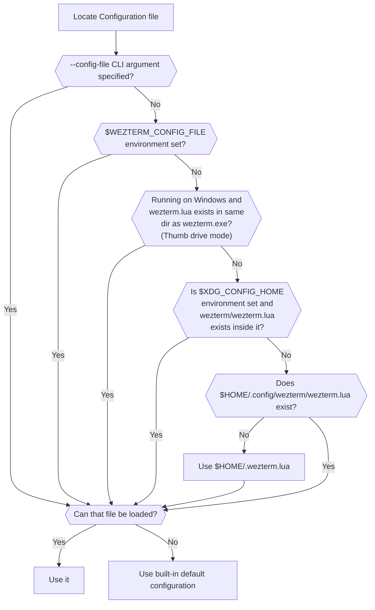

## Configuration Files

`wezterm` will look for a [lua](https://www.lua.org/manual/5.3/manual.html)
configuration file using the logic shown below.

The recommendation is to place your configuration file at `$HOME/.wezterm.lua`
to get started.

More complex configurations that need to span multiple files can be placed in
`$XDG_CONFIG_HOME/wezterm/wezterm.lua` (for X11/Wayland) or
`$HOME/.config/wezterm/wezterm.lua` (for all other systems).



Prior to version 20210314-114017-04b7cedd, if the candidate file exists but
failed to parse, wezterm would treat it as though it didn't exist and continue
to try other candidate file locations. In all current versions of wezterm, an
error will be shown and the default configuration will be used instead.

Note that on Windows, to support users that carry their wezterm application and
configuration around on a thumb drive, wezterm will look for the config file in
the same location as wezterm.exe.  That is shown in the chart above as thumb
drive mode.

`wezterm` will watch the config file that it loads; if/when it changes, the
configuration will be automatically reloaded and the majority of options will
take effect immediately.  You may also use the `CTRL+SHIFT+R` keyboard shortcut
to force the configuration to be reloaded.

**The configuration file may be evaluated multiple times for each wezterm
process** both at startup and in response to the configuration file being
reloaded.  You should avoid taking actions in the main flow of the config file
that have side effects; for example, unconditionally launching background
processes can result in many of them being spawned over time if you launch
many copies of wezterm, or are frequently reloading your config file.

### Configuration Overrides

*since: 20210314-114017-04b7cedd*

`wezterm` allows overriding configuration values via the command line; here are
a couple of examples:

```bash
$ wezterm --config enable_scroll_bar=true
$ wezterm --config 'exit_behavior="Hold"'
```

Configuration specified via the command line will always override the values
provided by the configuration file, even if the configuration file is reloaded.

Each window can have an additional set of window-specific overrides applied to
it by code in your configuration file.  That's useful for eg: setting
transparency or any other arbitrary option on a per-window basis.  Read the
[window:set_config_overrides](lua/window/set_config_overrides.md) documentation
for more information and examples of how to use that functionality.

## Configuration File Structure

The `wezterm.lua` configuration file is a lua script which allows for a high
degree of flexibility.   The script is expected to return a configuration
table, so a basic empty configuration file will look like this:

```lua
return {}
```

Throughout these docs you'll find configuration fragments that demonstrate
configuration and that look something like this:

```lua
return {
  color_scheme = 'Batman',
}
```

and perhaps another one like this:

```lua
local wezterm = require 'wezterm'
return {
  font = wezterm.font 'JetBrains Mono',
}
```

If you wanted to use both of these in the same file, you would merge them together
like this:

```lua
local wezterm = require 'wezterm'
return {
  font = wezterm.font 'JetBrains Mono',
  color_scheme = 'Batman',
}
```


