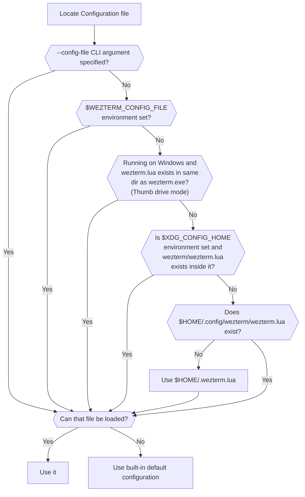

## Quick Start

Create a file named `.wezterm.lua` in your home directory, with the following
contents:

```lua
-- Pull in the wezterm API
local wezterm = require 'wezterm'

-- This will hold the configuration.
local config = wezterm.config_builder()

-- This is where you actually apply your config choices

-- For example, changing the color scheme:
config.color_scheme = 'AdventureTime'

-- and finally, return the configuration to wezterm
return config
```

## Configuration Files

`wezterm` will look for a [lua](https://www.lua.org/manual/5.3/manual.html)
configuration file using the logic shown below.

!!! tip
    The recommendation is to place your configuration file at `$HOME/.wezterm.lua`
    (`%USERPROFILE%/.wezterm.lua` on Windows) to get started.

More complex configurations that need to span multiple files can be placed in
`$XDG_CONFIG_HOME/wezterm/wezterm.lua` (for X11/Wayland) or
`$HOME/.config/wezterm/wezterm.lua` (for all other systems).





Prior to version 20210314-114017-04b7cedd, if the candidate file exists but
failed to parse, wezterm would treat it as though it didn't exist and continue
to try other candidate file locations. In all current versions of wezterm, an
error will be shown and the default configuration will be used instead.

!!! note
    On Windows, to support users that carry their wezterm application and
    configuration around on a thumb drive, wezterm will look for the config file in
    the same location as wezterm.exe.  That is shown in the chart above as thumb
    drive mode.  It is **not** recommended to store your configs in that
    location if you are not running off a thumb drive.

`wezterm` will watch the config file that it loads; if/when it changes, the
configuration will be automatically reloaded and the majority of options will
take effect immediately.  You may also use the `CTRL+SHIFT+R` keyboard shortcut
to force the configuration to be reloaded.

!!! info
    **The configuration file may be evaluated multiple times for each wezterm
    process** both at startup and in response to the configuration file being
    reloaded.  You should avoid taking actions in the main flow of the config file
    that have side effects; for example, unconditionally launching background
    processes can result in many of them being spawned over time if you launch
    many copies of wezterm, or are frequently reloading your config file.

### Configuration Overrides

{{since('20210314-114017-04b7cedd')}}

`wezterm` allows overriding configuration values via the command line; here are
a couple of examples:

```bash
$ wezterm --config enable_scroll_bar=true
$ wezterm --config 'exit_behavior="Hold"'
```

Configuration specified via the command line will always override the values
provided by the configuration file, even if the configuration file is reloaded.

Each window can have an additional set of window-specific overrides applied to
it by code in your configuration file.  That's useful for eg: setting
transparency or any other arbitrary option on a per-window basis.  Read the
[window:set_config_overrides](lua/window/set_config_overrides.md) documentation
for more information and examples of how to use that functionality.

## Configuration File Structure

The `wezterm.lua` configuration file is a lua script which allows for a high
degree of flexibility.   The script is expected to return a configuration
table, so a basic empty (and rather useless!) configuration file will look like
this:

```lua
return {}
```

Throughout these docs you'll find configuration fragments that demonstrate
configuration and that look something like this:

```lua
local wezterm = require 'wezterm'
local config = {}

config.color_scheme = 'Batman'

return config
```

and perhaps another one like this:

```lua
local wezterm = require 'wezterm'
local config = {}

config.font = wezterm.font 'JetBrains Mono'

return config
```

If you wanted to use both of these in the same file, you would merge them together
like this:

```lua
local wezterm = require 'wezterm'
local config = {}

config.font = wezterm.font 'JetBrains Mono'
config.color_scheme = 'Batman'

return config
```

For the sake of brevity in these docs, individual snippets may be shown as
just the config assignments:

```lua
config.color_scheme = 'Batman'
```

## Making your own Lua Modules

If you'd like to break apart your configuration into multiple files, you'll
be interested in this information.

The Lua `package.path` is configured with the following paths in this order:

* On Windows: a `wezterm_modules` dir in the same directory as `wezterm.exe`. This is for thumb drive mode, and is not recommended to be used otherwise.
* `~/.config/wezterm`
* `~/.wezterm`
* A system specific set of paths which may (or may not!) find locally installed lua modules

That means that if you wanted to break your config up into a `helpers.lua` file
you would place it in `~/.config/wezterm/helpers.lua` with contents like this:

```lua
-- I am helpers.lua and I should live in ~/.config/wezterm/helpers.lua

local wezterm = require 'wezterm'

-- This is the module table that we will export
local module = {}

-- This function is private to this module and is not visible
-- outside.
local function private_helper()
  wezterm.log_error 'hello!'
end

-- define a function in the module table.
-- Only functions defined in `module` will be exported to
-- code that imports this module.
-- The suggested convention for making modules that update
-- the config is for them to export an `apply_to_config`
-- function that accepts the config object, like this:
function module.apply_to_config(config)
  private_helper()

  config.color_scheme = 'Batman'
end

-- return our module table
return module
```

and then in your `wezterm.lua`
you would use it like this:

```lua
local helpers = require 'helpers'
local config = {}
helpers.apply_to_config(config)
return config
```


## Configuration Reference

Continue browsing this section of the docs for an overview of the commonly
adjusted settings, or visit the [Lua Config Reference](lua/config/index.md) for a more detailed list of possibilities.
