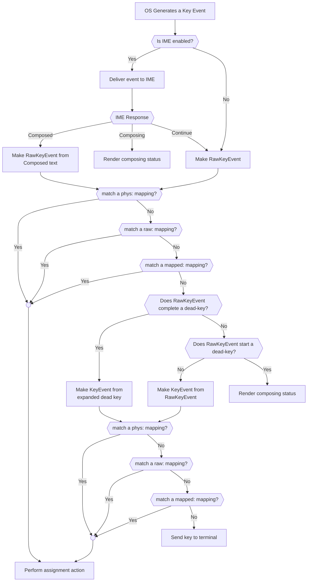

`wezterm` allows assigning action(s) to specific key events, and comes
pre-configured with a number of commonly useful assignments.

This page describes how key presses are handled and turned into actions
or sent to the terminal as text.

It's important to understand these concepts when considering keyboard input;
first, some operating system concepts:

* *Input Method Editor* (IME) - An OS-provided service which allows
  for rich composition of input, often with a pop-over candidate
  selection window.  This is commonly used for Asian input, but on
  some systems the IME may also be responsible for emoji input or
  dead keys.  The IME may have multiple modes per language and those
  modes can be changed dynamically.
* *Keyboard Layout* - An OS configuration that describes how to translate
  physical key button presses into inputs appropriate to the user's
  preferred input locale. The mapping performed by the layout is
  largely opaque to applications and, on most systems, can be changed
  dynamically.
* *Dead Key* - a keyboard layout may define these modal keys
  which don't immediately produce output (and thus appears to be "dead"),
  but instead holds some state that will compose with a subsequently
  pressed key. Most commonly used for example in European layouts to
  produce accented versions of the plain latin alphabet.
* *Physical Key* - a way to identify a key based on its hardware-dependent location. `wezterm` can refer to keys based on code they would emit if configured to use an ANSI US English keyboard layout (even if that layout is not currently active), or based on its raw scan code.
* *Mapped key* - a way to identify a key after the keyboard layout has been applied by the OS.
* *Modifier* - A key such as `SHIFT`, `CTRL`, `CMD`, `ALT` that can be held simultaneously while other keys are pressed. Modifier keys are special because keyboard hardware traditionally only supports those four modifiers, and that detail is ingrained into most OS input APIs.

And then some wezterm concepts:

* *Key Assignment* - an action assigned to a matching key and modifier combination.
* *Key Table* - a grouping of key assignments. For each window, `wezterm` maintains a stack of table activations, allowing for rich modal keyboard input customization


## Keyboard Processing Flow

This schematic depicts the processing flow for keyboard events in `wezterm`:





## Alt / Option Key Behavior & Composed Keys

The operating system has its own user selectable keymap that is sometimes at
odds with old-school terminal emulation that pre-dates internationalization as
a concept.  WezTerm tries to behave reasonably by default, but also give you
control in other situations.

### Layouts with an AltGr key

If you have, for example, a European keyboard layout with an AltGr key then
wezterm will respect the composition effects of AltGr produced by the system.
For example, in a German keymap, `AltGr <` will produce `|`.

If your physical keyboard doesn't match the keyboard layout (eg: using a US
keyboard with DEU selected in the OS), then the right hand `Alt` key is often
re-interpreted as having the `AltGr` function with behavior as described above.

The left `Alt` will be treated as a modifier with no composition effects.

### Microsoft Windows and Ctrl-Alt <-> AltGr

If you are using VNC and a keyboard layout with dead keys, then you may wish to
enable
[treat_left_ctrlalt_as_altgr](lua/config/treat_left_ctrlalt_as_altgr.md).

### macOS Left and Right Option Key

{{since('20200620-160318-e00b076c')}}

The default behavior is to treat the left `Option` key as the `Alt` modifier
with no composition effects, while the right `Option` key performs composition
(making it approximately equivalent to `AltGr` on other operating systems).

You can control this behavior in your configuration:

```lua
config.send_composed_key_when_left_alt_is_pressed = false
config.send_composed_key_when_right_alt_is_pressed = true
```

{{since('20210203-095643-70a364eb')}}

WezTerm is now able to perform dead-key expansion when `use_ime = false`.  Dead
keys are treated as composition effects, so with the default settings of
`send_composed_key_when_left_alt_is_pressed` and
`send_composed_key_when_right_alt_is_pressed` above, in a US layout, `Left-Opt
n` will produce `Alt N` and `Right-Opt n` will for a subsequent key press
before generating an event; `Right-Opt n SPACE` will emit `~` whereas `Right-Opt n
n` will emit `ñ`.

You may also set `use_dead_keys = false` to skip the hold state; continuing
the example above, `Right-Opt n` will then immediately produce `~`.

### Input Method Editor (IME)

WezTerm has support for using the operating system Input Method Editor (IME) on
some operating systems.

[The `use_ime` docs have more information](lua/config/use_ime.md).

### Dead Keys

{{since('20201031-154415-9614e117')}}

By default, if you are using a layout with *dead keys* (eg: US International
layout, or a number of European layouts such as German or French) pressing
a dead key in wezterm will "hold" the dead key until the next character is
pressed, resulting in a combined character with a diacritic.  For example,
pressing `^` and then `e` will produce `ê`.  Pressing `^` then `SPACE`
will produce `^` on its own.

If you are a heavy user of Vi style editors then you may wish to disable
dead key processing so that `^` can be used with a single keypress.

You can tell WezTerm to disable dead keys by setting this in your configuration
file:

```lua
config.use_dead_keys = false
```

Note that for X11 systems with `use_ime=true`, depending on the configured IME,
the IME may handle dead key processing implicitly. There is no way for
`wezterm` to prevent it from doing that, short of disabling the IME.

### Defining Assignments for key combinations that may be composed

When a key combination produces a composed key result, wezterm will look up
both the composed and uncomposed versions of the keypress in your key mappings.
If either lookup matches your assignment, that will take precedence over
the normal key processing.


