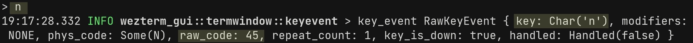

# Key Assignments/Keybindings

## Default Keybindings

Wezterm comes preconfigured with a large number of [default keybindings](default-keys.md).

### Disabling Default Keybindings

The [default key table assignments](default-keys.md) can be overridden or extended by adding a `keys` table to your `~/.wezterm.lua` config file.

For example, you can disable an individual default assignment like this:

```lua
local wezterm = require 'wezterm'

return {
  keys = {
    -- Turn off the default CMD-m Hide action, allowing CMD-m to
    -- be potentially recognized and handled by the tab
    {
      key = 'm',
      mods = 'CMD',
      action = wezterm.action.DisableDefaultAssignment,
    },
  },
}
```

You can also turn off all default keybindings entirely via:

```lua
return {
  disable_default_key_bindings = true,
}
```

## Creating New Assignment

Key assigments can be defined in your `wezterm.lua` config by adding key config structs to the `keys` table e.g.

```lua
local wezterm = require 'wezterm'

-- Start of main config table
return {
  -- Start of keys table
  keys = {
    -- Key config struct 1
    { key = '0', mods = 'SUPER', action = wezterm.action.ResetFontSize },
    -- Key config struct 2
    {
      key = 'l',
      mods = 'ALT',
      action = wezterm.action.ShowLauncher,
    },
  },
}
```
## Key Config Struct

A key config struct consists of 3 fields:

**Fields:**

- key (required)
- mods (optional)
- action (required)

example of possible field assignments: 

| `key = `  | `mods =`      | `action =`                      |
| --------- | ------------- | ------------------------------- |
| 'P'       | 'SUPER'       | wezterm.action.SpawnWindow      |
| "Escape"  | 'CTRL\|SHIFT' | wezterm.action.ShowDebugOverlay |
| "UpArrow" |               | wezterm.action.Nop              |


Using the 3 fields, we can construct key assignment structs in our config e.g.

```lua
return {
  keys = {
    -- Key config struct 1
    { key = '0', mods = 'SUPER', action = wezterm.action.ResetFontSize },
    -- Key config struct 2
    {
      key = 'l',
      mods = 'ALT',
      action = wezterm.action.ShowLauncher,
    },
  },
}
```

The `action` value can be one of the [available key assignments](lua/keyassignment/index.md).
Every action has an example that shows how to use it.

Possible Modifier labels are:

* `SUPER`, `CMD`, `WIN` may be used for platform agnostic configs & are all equivalent to: 
   * on macOS the `Command` key
   * on Windows the `Windows` key
   * on Linux the `Super` or `Hyper` keys
 * `CTRL` - The control key, left and right variants are equivalent
 * `SHIFT` - The shift key, left and right variants are equivalent
 * `ALT`, `OPT`, `META` may be used for platform agnostic configs & are all equivalent to: 
   * on macOS the `Option` key
   * on other platforms the `Alt` or `Meta` key, left and right variants are equivalent
 * `LEADER` - a special modal modifier state managed by `wezterm`.
    See [Leader Key](#leader-key) for more information.
 * `VoidSymbol` - This keycode is emitted in special cases where the original
   function of the key has been removed. Such as in Linux and using `setxkbmap`.
   `setxkbmap -option caps:none`. The `CapsLock` will no longer function as
   before in all applications, instead emitting `VoidSymbol`.

You can combine modifiers using the `'|'` symbol e.g.

```lua
local wezterm = require 'wezterm'
return {
  keys = {
    -- Key assignment using a multi-key modifier
    {
      key = 'R',
      mods = 'SHIFT|SUPER',
      action = wezterm.action.ReloadConfiguration,
    },
  },
}
```

Alternatively, a single unicode character can be specified to indicate
pressing the corresponding key.

Pay attention to key assignment that use `SHIFT` in the modifer.
There is an open issue [#1906](https://github.com/wez/wezterm/issues/1906) that prevents the ability to discern `SHIFT` being used as part of the modifier sequence versus being used to access the assigned key.
This issue pertains to non-alphabetic charater keys such as `'+'`, `'_'`, `'|'`, etc. e.g.
```lua
local wezterm = require 'wezterm'
return {
  keys = {
    -- This will not be abled to be triggered
    { key = '+', mods = 'SUPER', action = wezterm.action.IncreaseFontSize },
    -- This WILL be abled to be triggered
    {
      key = '+',
      mods = 'SUPER|SHIFT',
      action = wezterm.action.IncreaseFontSize,
    },
  },
}
```

The `key` value can be one of the following keycode identifiers.  Note that not
all of these are meaningful on all platforms:

|                      |                        |                         |                  |
| -------------------- | ---------------------- | ----------------------- | ---------------- |
| `Hyper`              | `Super`                | `Meta`                  | `Escape`         |
| `Control`            | `LeftControl`          | `RightControl`          | `Execute`        |
| `Alt`                | `LeftAlt`              | `RightAlt`              | `Select`         |
| `Shift`              | `LeftShift`            | `RightShift`            | `Sleep`          |
| `Menu`               | `LeftMenu`             | `RightMenu`             |                  |
| `Applications`       | `LeftWindows`          | `RightWindows`          |                  |
| `UpArrow`            | `LeftArrow`            | `RightArrow`            | `DownArrow`      |
| `Tab`                | `Enter`                | `Clear`                 | `Help`           |
| `Insert`             | `Delete`               | `Backspace`             | `Cancel`         |
| `PageUp`             | `PageDown`             | `Home`                  | `End`            |
| `NumLock`            | `ScrollLock`           | `CapsLock`              |                  |
| `VolumeUp`           | `VolumeDown`           | `VolumeMute`            |                  |
| `VoidSymbol`         | `Separator`            | `PrintScreen`           | `Print`          |
| `F1`                 | `F2`                   | `F...`                  | `F24`            |
| `Numpad0`            | `Numpad1`              | `Numpad...`             | `Numpad9`        |
| `BrowserForward`     | `BrowserBack`          | `BrowserHome`           | `BrowserRefresh` |
| `BrowserStop`        | `BrowserSearch`        | `BrowserFavorites`      | `Pause`          |
| `MediaPlayPause`     | `MediaNextTrack`       | `MediaPrevTrack`        | `MediaStop`      |
| `Add`                | `Subtract`             | `Multiply`              | `Divide`         |
| `Decimal`            | `ApplicationLeftArrow` | `ApplicationRightArrow` |                  |
| `ApplicationUpArrow` | `ApplicationDownArrow` |                         |                  |


## Physical vs Mapped Key Assignments

*Since: 20220319-142410-0fcdea07*

The `key` value can refer either to the physical position of a key on an ANSI
US keyboard or to the post-keyboard-layout-mapped value produced by a key
press.

You can explicitly assign using the physical position by adding a `phys:` prefix
to the value, for example: `key="phys:A"`.  This will match key presses for
the key that would be in the position of the `A` key on an ANSI US keyboard.

You can explicitly assign the mapped key by adding a `mapped:` prefix to the
value, for example: `key="mapped:a"` will match a key press where the OS
keyboard layout produces `a`, regardless of its physical position.

If you omit an explicit prefix, wezterm will assume `phys:` and use the
physical position of the specified key.

The default key assignments listed above use `phys:`.  In previous releases
there was no physical position support and those assignments were all `mapped:`.

When upgrading from earlier releases, if you had `{key="N", mods="CMD", ..}` in
your config, you will need to change it to either
`{key="N", mods="CMD|SHIFT", ..}` or `{key="mapped:N", mods="CMD", ..}`
in order to continue to respect the `SHIFT` modifier.

*Since: 20220408-101518-b908e2dd*

A new `key_map_preference` option controls how keys without an explicit `phys:`
or `mapped:` prefix are treated. If `key_map_preference = "Mapped"` (the
default), then `mapped:` is assumed. If `key_map_preference = "Physical"` then
`phys:` is assumed.

The default key assignments will respect `key_map_preference`.

## Raw Key Assignments

In some cases, `wezterm` may not know how to represent a key event in either
its `phys:` or `mapped:` forms.  In that case, you may wish to define an
assignment in terms of the underlying operating system key code, using a `raw:`
prefix.

Similar in concept to the `phys:` mapping described above, the `raw:` mapping
is independent of the OS keyboard layout.  Raw codes are hardware and windowing system dependent, so there is no portable way to list which key does what.

To discover these values, you can set [debug_key_events = true](lua/config/debug_key_events.md) in your config, this will log key events in the [debug overlay](lua/keyassignment/ShowDebugOverlay.md) e.g.



You can specify a raw key value of 123 by using `key="raw:123"` in your config
rather than one of the other key values.

```lua
local wezterm = require 'wezterm'
return {
  keys = {
    -- These are the same key assignments
    { key = 'raw:45', mods = 'SUPER', action = wezterm.action.SpawnWindow },
    { key = 'n', mods = 'SUPER', action = wezterm.action.SpawnWindow },
  },
}
```
## Leader Key

*Since: 20201031-154415-9614e117*

The *leader* key is a modal modifier key that takes 3 fields:

**Fields:**

- key (required)
- mods (optional)
- timeout_milliseconds (optional)
  - default: 1000 ms (1 second)


If leader is specified in the configuration then pressing that key combination will enable a virtual `LEADER` modifier.

While `LEADER` is active, only defined key assignments that include `LEADER` in the `mods` mask will be recognized. Other key presses will be swallowed and **NOT** passed through to the terminal.

`LEADER` stays active until a keypress is registered (whether it matches a key binding or not),
or until it has been active for the duration specified by `timeout_milliseconds`, at which point it will automatically cancel itself.

Here's an example configuration using `LEADER`.

In this configuration,
pressing `CTRL-A` activates the leader key for up to 1 second (1000 milliseconds).<br>
While `LEADER` is active, the `'|'` key (with no other modifiers) will trigger the current pane to be split.

```lua
local wezterm = require 'wezterm'

return {
  -- timeout_milliseconds defaults to 1000 and can be omitted
  leader = { key = 'a', mods = 'CTRL', timeout_milliseconds = 1000 },
  keys = {
    {
      key = '|',
      mods = 'LEADER|SHIFT',
      action = wezterm.action.SplitHorizontal { domain = 'CurrentPaneDomain' },
    },
    -- Send "CTRL-A" to the terminal when pressing CTRL-A, CTRL-A
    {
      key = 'a',
      mods = 'LEADER|CTRL',
      action = wezterm.action.SendString '\x01',
    },
  },
}
```

## VoidSymbol

*Since: 20210814-124438-54e29167*

On X11 systems, If you decide to change certain keys on the keyboard to
`VoidSymbol` (like `CapsLock`), then you can utilize it as a `LEADER` or any
other part of key bindings. The following example now uses `VoidSymbol` and
uses `CapsLock` as a `LEADER` without it affecting the shift / capital state as
long as you have `setxkbmap -option caps:none` configured.

```lua
local wezterm = require 'wezterm'

return {
  -- timeout_milliseconds defaults to 1000 and can be omitted
  -- for this example use `setxkbmap -option caps:none` in your terminal.
  leader = { key = 'VoidSymbol', mods = '', timeout_milliseconds = 1000 },
  keys = {
    {
      key = '|',
      mods = 'LEADER|SHIFT',
      action = wezterm.action.SplitHorizontal { domain = 'CurrentPaneDomain' },
    },
    {
      key = '-',
      mods = 'LEADER',
      action = wezterm.action.SplitVertical { domain = 'CurrentPaneDomain' },
    },
  },
}
```

## Available Actions

See the [`KeyAssignment` reference](lua/keyassignment/index.md) for information
on available actions.

