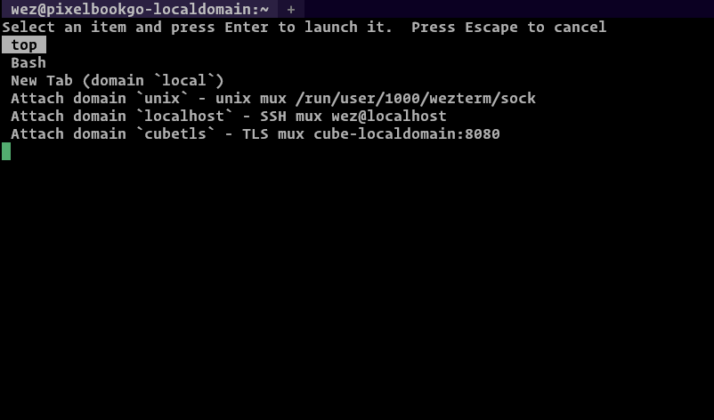

## Launching Programs

By default, when opening new tabs or windows, your shell will be spawned.

Your shell is determined by the following rules:

=== "On Posix Systems"

    The shell configured for the current user in the password database will be
    used.  The value of the `$SHELL` environment variable is **_deliberately
    ignored_** in order for wezterm to continue to be functional without
    restarting after the user changes their shell.

    wezterm will set the `$SHELL` environment variable to the shell that it
    resolved from the password database. If you want to control the value of
    `$SHELL` in your spawned processes, use
    [set_environment_variables](lua/config/set_environment_variables.md) to
    define the value you prefer.

    The shell will be spawned as `-<SHELL>` (with a `-` prefixed to its *ARGV0*)
    to invoke it as a login shell.  A login shell generally loads additional
    startup files and sets up more environment than a non-login shell.

    Older versions of wezterm (circa 2022 and earlier) used slightly
    different logic to determine the default program and invoke it.

=== "On Windows Systems"

    1. The value of the `%COMSPEC%` environment variable is used if it is set.
       **It is not recommended to change COMSPEC**, keep reading this
       page of the documentation to learn how to make wezterm
       run a different program.

    2. Otherwise, `cmd.exe`

## Changing the default program

If you'd like `wezterm` to run a different program than the shell as
described above, you can use the `default_prog` config setting to specify
the argument array; the array allows specifying the program and arguments
portably:

```lua
-- Spawn a fish shell in login mode
config.default_prog = { '/usr/local/bin/fish', '-l' }
```

## Launching a different program as a one off via the CLI

If you want to make a shortcut for your desktop environment that will,
for example, open an editor in wezterm you can use the `start` subcommand
to launch it.  This example opens up a new terminal window running vim
to edit your wezterm configuration:

```console
$ wezterm start -- vim ~/.wezterm.lua
```

## Specifying the current working directory

If you'd like `wezterm` to start running a program in a specific working
directory you can do so via the config, CLI, and when using
[`SpawnCommand`](lua/SpawnCommand.md):

* Setting the [`default_cwd`](lua/config/default_cwd.md) via the config:

  ```lua
  config.default_cwd = "/some/path"
  ```

* One off program in a specific working directory via the CLI:

  ```console
  $ wezterm start --cwd /some/path
  ```

* The [`SpawnCommandInNewTab`](lua/keyassignment/SpawnCommandInNewTab.md),
  and [`SpawnCommandInNewWindow`](lua/keyassignment/SpawnCommandInNewWindow.md)
  key assignments, and the [Launcher Menu](#the-launcher-menu) described below
  all accept a [`SpawnCommand`](lua/SpawnCommand.md) object that accepts an
  optional `cwd` field:

  ```lua
  {
    label = "List files in /some/path",
    args = {"ls", "-al"},
    cwd = "/some/path",
  }
  ```

Panes/Tabs/Windows created after the first will generally try to resolve the
current working directory of the current Pane, preferring
[a value set by OSC 7](../shell-integration.md) and falling back to
attempting to lookup the `cwd` of the current process group leader attached to a
local Pane. If no `cwd` can be resolved, then the `default_cwd` will be used.
If `default_cwd` is not specified, then the home directory of the user will be
used.

[See `default_cwd` for an easier to understand visualization](lua/config/default_cwd.md).

## Passing Environment variables to the spawned program

The [set_environment_variables](lua/config/set_environment_variables.md)
configuration setting can be used to add environment variables to the
environment of the spawned program.

The behavior is to take the environment of the `wezterm` process
and then set the specified variables for the spawned process.

```lua
config.set_environment_variables = {
  -- This changes the default prompt for cmd.exe to report the
  -- current directory using OSC 7, show the current time and
  -- the current directory colored in the prompt.
  prompt = '$E]7;file://localhost/$P$E\\$E[32m$T$E[0m $E[35m$P$E[36m$_$G$E[0m ',
}
```

# The Launcher Menu

The launcher menu is accessed from the new tab button in the tab bar UI; the
`+` button to the right of the tabs.  Left clicking on the button will spawn a
new tab, but right clicking on it will open the launcher menu.  You may also
bind a key to the [ShowLauncher](lua/keyassignment/ShowLauncher.md) or
[ShowLauncherArgs](lua/keyassignment/ShowLauncherArgs.md) action to trigger the
menu.

The launcher menu by default lists the various multiplexer domains and offers
the option of connecting and spawning tabs/windows in those domains.

You can define your own entries using the
[launch_menu](lua/config/launch_menu.md) configuration setting.  The snippet
below adds two new entries to the menu; one that runs the `top` program to
monitor process activity and a second one that explicitly launches the `bash`
shell.

Each entry in `launch_menu` is an instance of a
[SpawnCommand](lua/SpawnCommand.md) object.

```lua
config.launch_menu = {
  {
    args = { 'top' },
  },
  {
    -- Optional label to show in the launcher. If omitted, a label
    -- is derived from the `args`
    label = 'Bash',
    -- The argument array to spawn.  If omitted the default program
    -- will be used as described in the documentation above
    args = { 'bash', '-l' },

    -- You can specify an alternative current working directory;
    -- if you don't specify one then a default based on the OSC 7
    -- escape sequence will be used (see the Shell Integration
    -- docs), falling back to the home directory.
    -- cwd = "/some/path"

    -- You can override environment variables just for this command
    -- by setting this here.  It has the same semantics as the main
    -- set_environment_variables configuration option described above
    -- set_environment_variables = { FOO = "bar" },
  },
}
```



Here's a fancy example that will add some helpful entries to the launcher
menu when running on Windows:

```lua
local wezterm = require 'wezterm'
local launch_menu = {}

if wezterm.target_triple == 'x86_64-pc-windows-msvc' then
  table.insert(launch_menu, {
    label = 'PowerShell',
    args = { 'powershell.exe', '-NoLogo' },
  })

  -- Find installed visual studio version(s) and add their compilation
  -- environment command prompts to the menu
  for _, vsvers in
    ipairs(
      wezterm.glob('Microsoft Visual Studio/20*', 'C:/Program Files (x86)')
    )
  do
    local year = vsvers:gsub('Microsoft Visual Studio/', '')
    table.insert(launch_menu, {
      label = 'x64 Native Tools VS ' .. year,
      args = {
        'cmd.exe',
        '/k',
        'C:/Program Files (x86)/'
          .. vsvers
          .. '/BuildTools/VC/Auxiliary/Build/vcvars64.bat',
      },
    })
  end
end

return {
  launch_menu = launch_menu,
}
```
