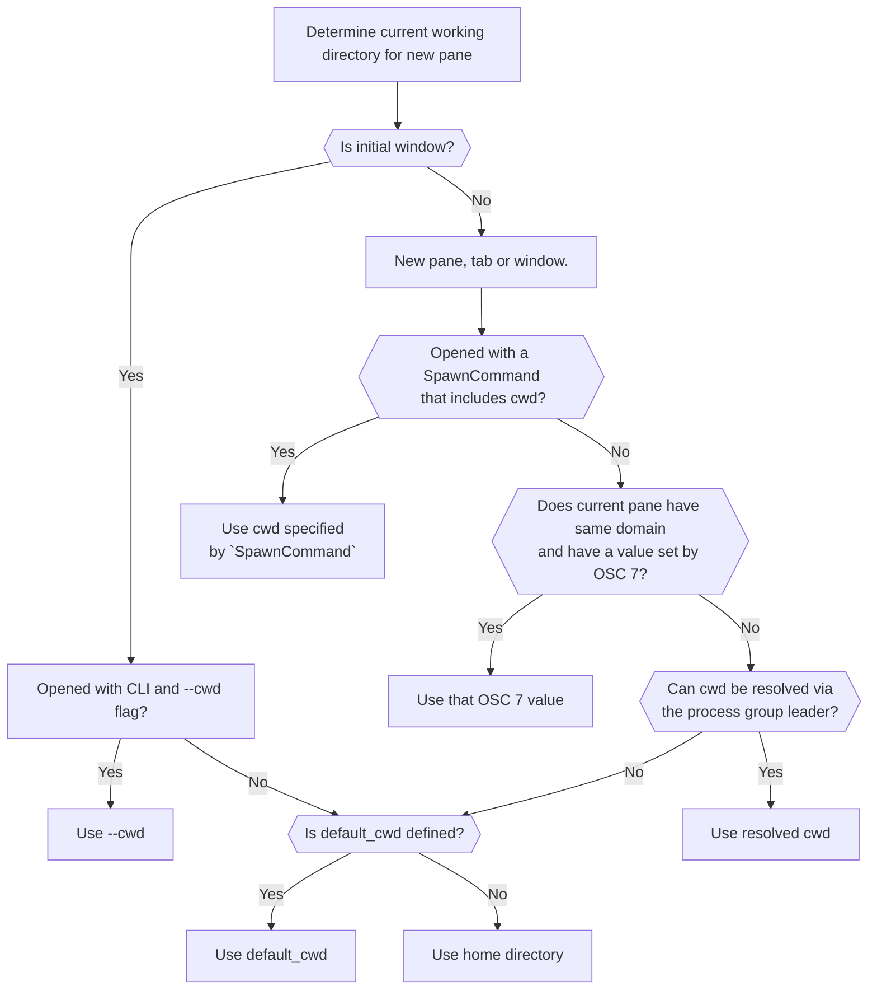

---
tags:
  - spawn
---
# `default_cwd`

{{since('20210203-095643-70a364eb')}}

Sets the default current working directory used by the initial window.

The value is a string specifying the absolute path that should be used for the
home directory. Using strings like `~` or `~username` that are typically
expanded by the shell is **not supported**. You can use
[wezterm.home_dir](../wezterm/home_dir.md) to explicitly refer to your home
directory.

If `wezterm start --cwd /some/path` is used to specify the current working
directory, that will take precedence.

Commands launched using [`SpawnCommand`](../SpawnCommand.md) will use the
`cwd` specified in the `SpawnCommand`, if any.

Panes/Tabs/Windows created after the first will generally try to resolve the
current working directory of the current Pane, preferring
[a value set by OSC 7](../../../shell-integration.md) and falling back to
attempting to lookup the `cwd` of the current process group leader attached to a
local Pane. If no `cwd` can be resolved, then the `default_cwd` will be used.
If `default_cwd` is not specified, then the home directory of the user will be
used.





On macOS and Linux, `wezterm` can attempt to resolve the process group leader
and then attempt to resolve its current working directory. This is not
guaranteed to succeed, and there are a number of potential edge cases (which is
another reason for configuring your shell to use OSC 7 sequences).

On Windows, there isn't a process group leader concept, but `wezterm` will
examine the process tree of the program that it started in the current pane and
use some heuristics to determine an approximate equivalent.

