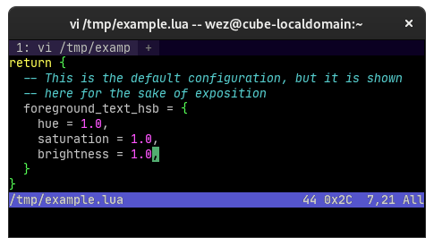
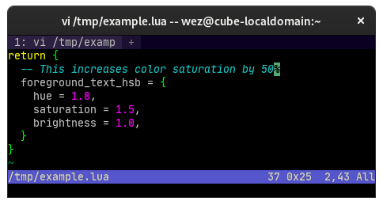
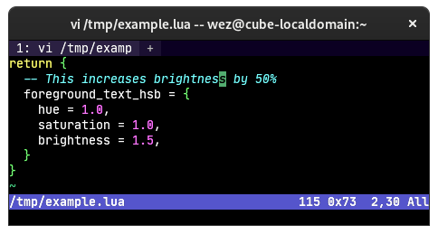
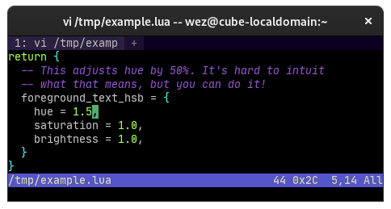

---
tags:
  - appearance
---
# `foreground_text_hsb`

{{since('20210314-114017-04b7cedd')}}

Configures a Hue, Saturation, Brightness transformation that is applied to
monochrome glyphs.

The transform works by converting the RGB colors to HSV values and
then multiplying the HSV by the numbers specified in `foreground_text_hsb`.

Modifying the hue changes the hue of the color by rotating it through the color
wheel. It is not as useful as the other components, but is available "for free"
as part of the colorspace conversion.

Modifying the saturation can add or reduce the amount of "colorfulness". Making
the value smaller can make it appear more washed out.

Modifying the brightness can be used to dim or increase the perceived amount of
light.

The range of these values is 0.0 and up; they are used to multiply the existing
values, so the default of 1.0 preserves the existing component, whilst 0.5 will
reduce it by half, and 2.0 will double the value.

```lua
-- This increases color saturation by 50%
config.foreground_text_hsb = {
  hue = 1.0,
  saturation = 1.5,
  brightness = 1.0,
}
```





