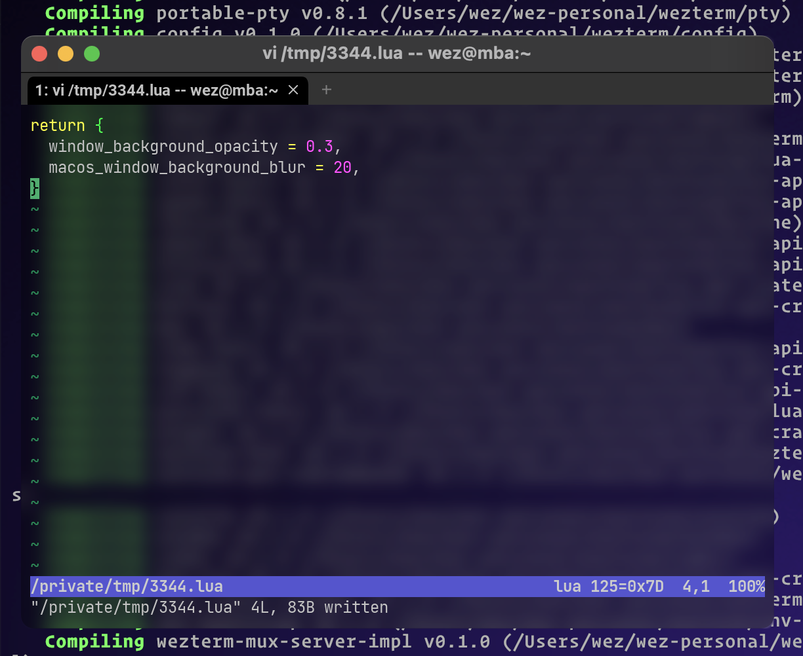

---
tags:
  - appearance
---
# `macos_window_background_blur = 0`

{{since('20230326-111934-3666303c')}}

When combined with `window_background_opacity`, configures the blur radius
amount used by macOS when compositing the window on the screen.

This can be used to produce a translucent window effect rather than
a crystal clear transparent window effect.

The screenshot below was achieved using this configuration:

```lua
config.window_background_opacity = 0.3
config.macos_window_background_blur = 20
```



The default value for `macos_window_background_blur` is `0`.

See also [win32_system_backdrop](win32_system_backdrop.md) for a similar
effect on Windows.
