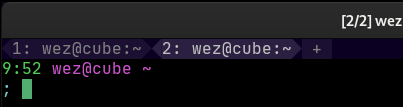

---
tags:
  - tab_bar
---
# `tab_bar_style`

{{since('20210814-124438-54e29167')}}

`new_tab_left`, `new_tab_right`, `new_tab_hover_left`, `new_tab_hover_right`
have been removed and replaced by the more flexible `new_tab` and `new_tab_hover` elements.

{{since('20210502-154244-3f7122cb')}}

`active_tab_left`, `active_tab_right`, `inactive_tab_left`,
`inactive_tab_right`, `inactive_tab_hover_left`, `inactive_tab_hover_right`
have been removed and replaced by the more flexible
[format-tab-title](../window-events/format-tab-title.md) event.

{{since('20210314-114017-04b7cedd')}}

This config option allows styling the elements that appear in the tab bar.
This configuration supplements the [tab bar color](../../appearance.md#tab-bar-appearance-colors)
options.

Styling in this context refers to how the edges of the tabs and the new tab button are rendered.
The default is simply a space character but you can use any sequence of formatted text produced
by the [wezterm.format](../wezterm/format.md) function.

The defaults for each of these styles is simply a space.  For each element, the foreground
and background colors are set as per the tab bar colors you've configured.

The available elements are:

* `active_tab_left`, `active_tab_right` - the left and right sides of the active tab
* `inactive_tab_left`, `inactive_tab_right` - the left and right sides of inactive tabs
* `inactive_tab_hover_left`, `inactive_tab_hover_right` - the left and right sides of inactive tabs in the hover state
* `new_tab_left`, `new_tab_right` - the left and right sides of the new tab `+` button
* `new_tab_hover_left`, `new_tab_hover_right` - the left and right sides of the new tab `+` button in the hover state.

This example changes the tab edges to the PowerLine arrow symbols:



```lua
local wezterm = require 'wezterm'

local config = wezterm.config_builder()

-- The filled in variant of the < symbol
local SOLID_LEFT_ARROW = wezterm.nerdfonts.pl_right_hard_divider

-- The filled in variant of the > symbol
local SOLID_RIGHT_ARROW = wezterm.nerdfonts.pl_left_hard_divider

config.tab_bar_style = {
  active_tab_left = wezterm.format {
    { Background = { Color = '#0b0022' } },
    { Foreground = { Color = '#2b2042' } },
    { Text = SOLID_LEFT_ARROW },
  },
  active_tab_right = wezterm.format {
    { Background = { Color = '#0b0022' } },
    { Foreground = { Color = '#2b2042' } },
    { Text = SOLID_RIGHT_ARROW },
  },
  inactive_tab_left = wezterm.format {
    { Background = { Color = '#0b0022' } },
    { Foreground = { Color = '#1b1032' } },
    { Text = SOLID_LEFT_ARROW },
  },
  inactive_tab_right = wezterm.format {
    { Background = { Color = '#0b0022' } },
    { Foreground = { Color = '#1b1032' } },
    { Text = SOLID_RIGHT_ARROW },
  },
}
```

#### Retro Tab Bar with Integrated Window Management Buttons

{{since('20230408-112425-69ae8472')}}

When using [`window_decorations =
"INTEGRATED_BUTTONS|RESIZE"`](window_decorations.md), you can
control how the different buttons are drawn for the retro tab bar:

* `window_hide`, `window_hide_hover` - the minimize/hide button
* `window_maximize`, `window_maximize_hover` - the maximize button
* `window_close`, `window_close_hover` - the close button

