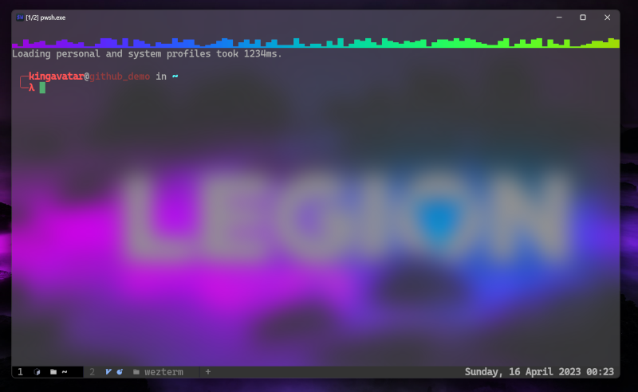
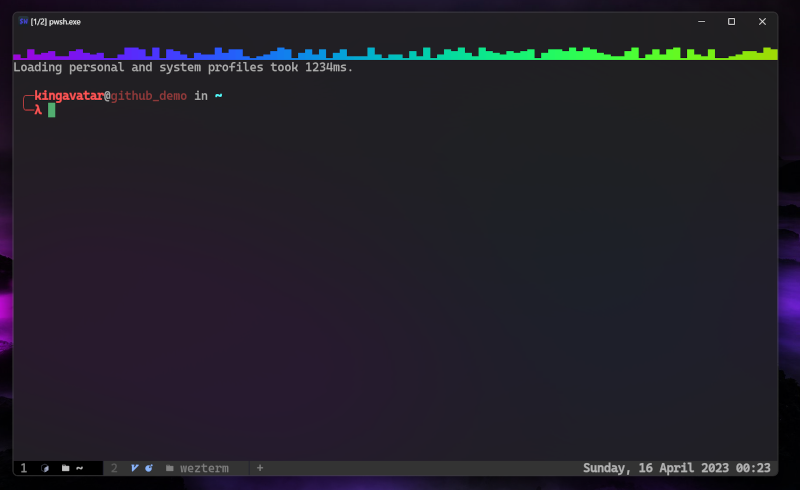
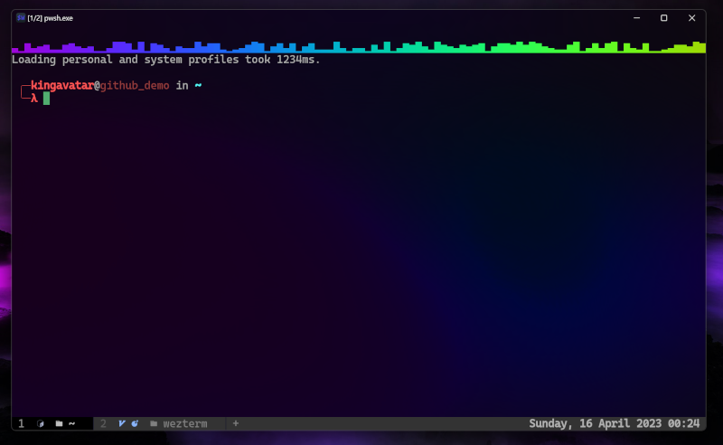

---
tags:
  - appearance
---

# `win32_system_backdrop = SETTING`

{{since('20230712-072601-f4abf8fd')}}

When combined with `window_background_opacity`, chooses from available
window background effects provided by Windows.

The possible values for `win32_system_backdrop` are:

* `"Auto"` - the system chooses. In practice, this is the same as `"Disable"`. This is the default value.
* `"Disable"` - disable backdrop effects.
* `"Acrylic"` - enable the *Acrylic* blur-behind-window effect.  Available on Windows 10 and 11.
* `"Mica"` - enable the *Mica* effect, available on Windows 11 build 22621 and later.
* `"Tabbed"` - enable the *Tabbed* effect, available on Windows 11 build 22621 and later.

On Windows systems earlier than build 22621, the *Acrylic* affect can be
adjusted using [win32_acrylic_accent_color](win32_acrylic_accent_color.md).
More recent versions of Windows do not permit configuring the accent color
for *Acrylic*, so that option has no effect there.

The *Acrylic* setting uses more resources than the others.

You need to reduce the `window_background_opacity` to a value lower than `1.0`
for the backdrop effect to work.  For best results with both `"Mica"` and
`"Tabbed"`, setting `window_background_opacity = 0` is recommended.

See also [macos_window_background_blur](macos_window_background_blur.md) for
a similar effect on macOS.

## Acrylic

```lua
config.window_background_opacity = 0
config.win32_system_backdrop = 'Acrylic'
```



## Mica

```lua
config.window_background_opacity = 0
config.win32_system_backdrop = 'Mica'
```



## Tabbed

```lua
config.window_background_opacity = 0
config.win32_system_backdrop = 'Tabbed'
```




