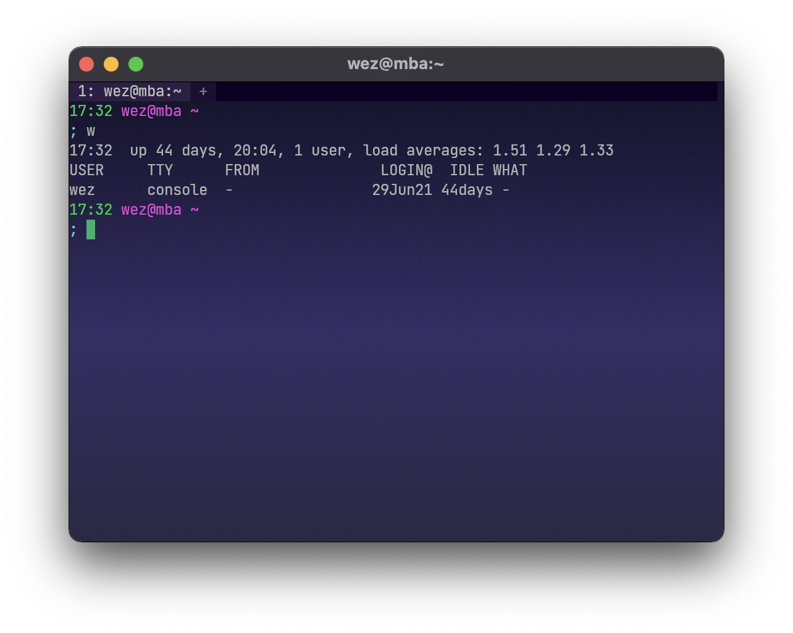

---
tags:
  - appearance
  - background
---
# `window_background_gradient`

{{since('20210814-124438-54e29167')}}

Dynamically generates a `window_background_image` from the provided gradient
specification.  When `window_background_gradient` is configured, the value
for `window_background_image` is ignored.

Linear gradients with vertical or horizontal orientation are supported:

```lua
config.window_background_gradient = {
  -- Can be "Vertical" or "Horizontal".  Specifies the direction
  -- in which the color gradient varies.  The default is "Horizontal",
  -- with the gradient going from left-to-right.
  -- Linear and Radial gradients are also supported; see the other
  -- examples below
  orientation = 'Vertical',

  -- Specifies the set of colors that are interpolated in the gradient.
  -- Accepts CSS style color specs, from named colors, through rgb
  -- strings and more
  colors = {
    '#0f0c29',
    '#302b63',
    '#24243e',
  },

  -- Instead of specifying `colors`, you can use one of a number of
  -- predefined, preset gradients.
  -- A list of presets is shown in a section below.
  -- preset = "Warm",

  -- Specifies the interpolation style to be used.
  -- "Linear", "Basis" and "CatmullRom" as supported.
  -- The default is "Linear".
  interpolation = 'Linear',

  -- How the colors are blended in the gradient.
  -- "Rgb", "LinearRgb", "Hsv" and "Oklab" are supported.
  -- The default is "Rgb".
  blend = 'Rgb',

  -- To avoid vertical color banding for horizontal gradients, the
  -- gradient position is randomly shifted by up to the `noise` value
  -- for each pixel.
  -- Smaller values, or 0, will make bands more prominent.
  -- The default value is 64 which gives decent looking results
  -- on a retina macbook pro display.
  -- noise = 64,

  -- By default, the gradient smoothly transitions between the colors.
  -- You can adjust the sharpness by specifying the segment_size and
  -- segment_smoothness parameters.
  -- segment_size configures how many segments are present.
  -- segment_smoothness is how hard the edge is; 0.0 is a hard edge,
  -- 1.0 is a soft edge.

  -- segment_size = 11,
  -- segment_smoothness = 0.0,
}
```



Gradients are implemented using the `colorgrad` crate.
Take a look at <https://github.com/mazznoer/colorgrad-rs#using-web-color-format>
for some usage examples and additional information about gradients.

## Linear gradient:

{{since('20220624-141144-bd1b7c5d')}}

A linear gradient follows a linear path across the window. It can be rotated
around the window center. The angle is described in degrees and moves 
counter clockwise in the positive direction.

So `0` degrees is equivalent to `Horizontal` with the gradient moving from left
to right. `90` degrees is equivalent to `Vertical` with the gradient moving from
bottom to top. `180` degrees is equivalent to `Horizontal` but with the gradient
moving from right to left. `270` degrees is equivalent to `Vertical` but with
the gradient going from top to bottom. Negative degrees are equivalent to going
clockwise, so `-45` is equivalent to `315` degrees and results in a gradient
that is moving from the top left corner down to the bottom right corner.

```lua
config.window_background_gradient = {
  colors = { '#EEBD89', '#D13ABD' },
  -- Specifies a Linear gradient starting in the top left corner.
  orientation = { Linear = { angle = -45.0 } },
}
```


## Radial gradient:

Radial gradients are implemented using a notional perfect circle that is
subsequently stretched to fill the dimensions of the window.

```lua
config.color_scheme = 'Github'
config.window_background_gradient = {
  colors = { 'deeppink', 'gold' },
  orientation = {
    Radial = {
      -- Specifies the x coordinate of the center of the circle,
      -- in the range 0.0 through 1.0.  The default is 0.5 which
      -- is centered in the X dimension.
      cx = 0.75,

      -- Specifies the y coordinate of the center of the circle,
      -- in the range 0.0 through 1.0.  The default is 0.5 which
      -- is centered in the Y dimension.
      cy = 0.75,

      -- Specifies the radius of the notional circle.
      -- The default is 0.5, which combined with the default cx
      -- and cy values places the circle in the center of the
      -- window, with the edges touching the window edges.
      -- Values larger than 1 are possible.
      radius = 1.25,
    },
  },
}
```


## Presets

The following presets are available:

|Preset|Gradient|
|------|--------|
|Blues||
|BrBg||
|BuGn||
|BuPu||
|Cividis||
|Cool||
|CubeHelixDefault||
|GnBu||
|Greens||
|Greys||
|Inferno||
|Magma||
|OrRd||
|Oranges||
|PiYg||
|Plasma||
|PrGn||
|PuBu||
|PuBuGn||
|PuOr||
|PuRd||
|Purples||
|Rainbow||
|RdBu||
|RdGy||
|RdPu||
|RdYlBu||
|RdYlGn||
|Reds||
|Sinebow||
|Spectral||
|Turbo||
|Viridis||
|Warm||
|YlGn||
|YlGnBu||
|YlOrBr||
|YlOrRd||
