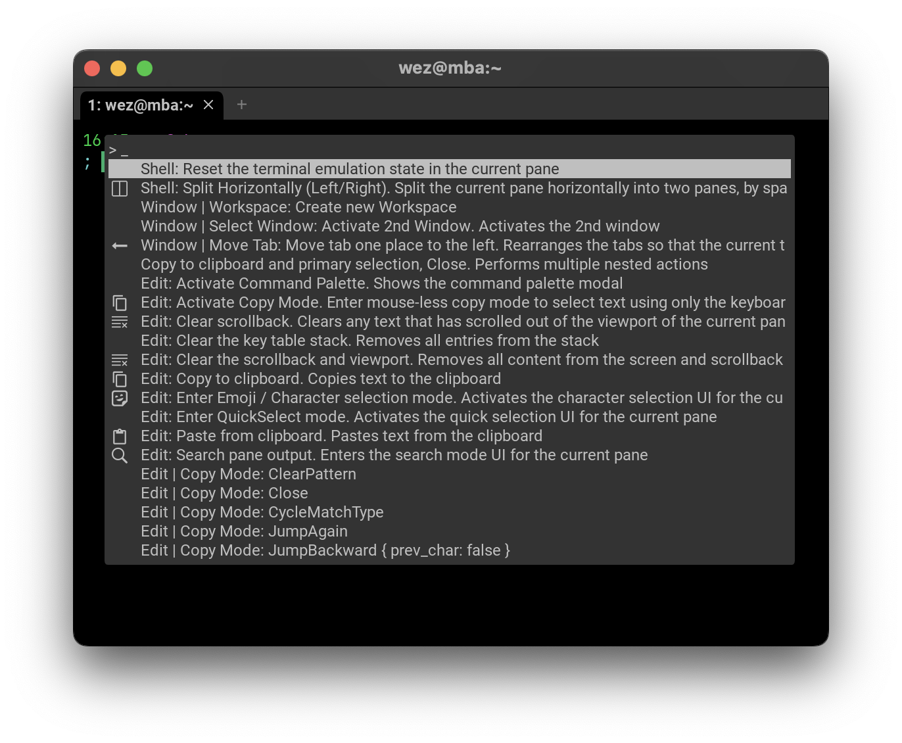

# `ActivateCommandPalette`

{{since('20230320-124340-559cb7b0')}}

Activates the Command Palette, a modal overlay that enables discovery and activation of various commands.

```lua
config.keys = {
  {
    key = 'P',
    mods = 'CTRL',
    action = wezterm.action.ActivateCommandPalette,
  },
}
```

<kbd>CTRL</kbd> + <kbd>SHIFT</kbd> + <kbd>P</kbd> is the default key assignment for `ActivateCommandPalette`.

The command palette shows a list of possible actions ranked by
[frecency](https://en.wikipedia.org/wiki/Frecency) of use from the command
palette.



### Key Assignments

| Action | Key Assignment |
|--------|----------------|
|Exit command palette| <kbd>Esc</kbd> |
|Highlight previous item| <kbd>UpArrow</kbd> |
|Highlight next item| <kbd>DownArrow</kbd> |
|Clear the selection| <kbd>CTRL</kbd> + <kbd>u</kbd> |
|Activate the selection| <kbd>Enter</kbd> |

Typing text (and using <kbd>Backspace</kbd>) allows you to fuzzy match possible
actions. Each keystroke will reduce the list of candidate actions to those that
fuzzy match, ranked in decreasing order of the match score.

Activating the selected item will close the command palette and then invoke the
action.

See also:

 * [command_palette_font_size](../config/command_palette_font_size.md)
 * [command_palette_fg_color](../config/command_palette_fg_color.md)
 * [command_palette_bg_color](../config/command_palette_bg_color.md)
 * [ui_key_cap_rendering](../config/ui_key_cap_rendering.md)
