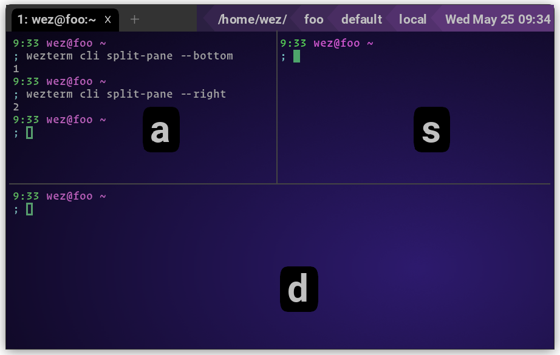

# `PaneSelect`

{{since('20220624-141144-bd1b7c5d')}}

This action activates the pane selection modal display. In this mode, each pane
will be overlayed with a one- or two-character label taken from the selection
alphabet.



Typing the label will select the pane, take an action and exit selection mode.
Pressing `Escape` or `CTRL-g` will exit pane selection mode without taking any
action.

The available actions are:

* `mode="Activate"` - activate the selected pane. This is the default mode.
* `mode="SwapWithActive"` - swap the position of the active pane with the
  selected pane, switching focus to the selected pane

The selection alphabet defaults to the same value as
[quick_select_alphabet](../config/quick_select_alphabet.md), but can be
explicitly via the `alphabet` field:

{{since('20240127-113634-bbcac864')}}

Additional modes are now supported:

* `mode="MoveToNewTab"` - moves the selected pane into a new tab in the same
  window, and activates it
* `mode="MoveToNewWindow"` - moves the selected pane into a new window, and
  activates it
* `mode="SwapWithActiveKeepFocus"` - swap the position of the active pane with
  the selected pane, retaining focus on the currently active pane but in its
  new position

You may now also set `show_pane_ids=true` to show the pane id alongside the label.

```lua
local wezterm = require 'wezterm'
local act = wezterm.action

-- 36 is the default, but you can choose a different size.
-- Uses the same font as window_frame.font
-- config.pane_select_font_size=36,

config.keys = {
  -- activate pane selection mode with the default alphabet (labels are "a", "s", "d", "f" and so on)
  { key = '8', mods = 'CTRL', action = act.PaneSelect },
  -- activate pane selection mode with numeric labels
  {
    key = '9',
    mods = 'CTRL',
    action = act.PaneSelect {
      alphabet = '1234567890',
    },
  },
  -- show the pane selection mode, but have it swap the active and selected panes
  {
    key = '0',
    mods = 'CTRL',
    action = act.PaneSelect {
      mode = 'SwapWithActive',
    },
  },
}
```

See also [RotatePanes](RotatePanes.md).
