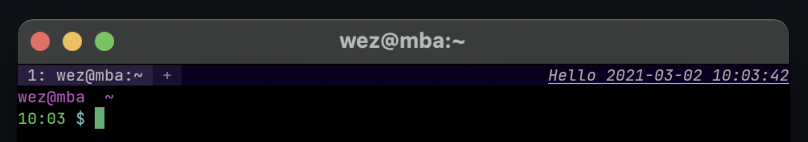
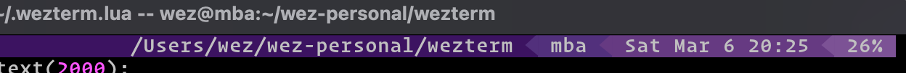

# `window:set_right_status(string)`

{{since('20210314-114017-04b7cedd')}}

This method can be used to change the content that is displayed in the tab bar,
to the right of the tabs and new tab button.  The content is displayed
right-aligned and will be clipped from the left edge to fit in the available
space.

The parameter is a string that can contain escape sequences that change presentation.

It is recommended that you use [wezterm.format](../wezterm/format.md) to compose
the string.

Here's a basic example that displays the time in the status area:



```lua
local wezterm = require 'wezterm'

wezterm.on('update-right-status', function(window, pane)
  local date = wezterm.strftime '%Y-%m-%d %H:%M:%S'

  -- Make it italic and underlined
  window:set_right_status(wezterm.format {
    { Attribute = { Underline = 'Single' } },
    { Attribute = { Italic = true } },
    { Text = 'Hello ' .. date },
  })
end)

return {}
```

Here's a rather more elaborate example that employs the popular PowerLine glyphs
to show a visually appealing status area.  It also extracts the current
working directory and hostname from the current pane. That way
it can potentially pick up the remote hostname if your remote shell session is using
[OSC 7 shell integration](../../../shell-integration.md#osc-7-escape-sequence-to-set-the-working-directory).



```lua
wezterm.on('update-right-status', function(window, pane)
  -- Each element holds the text for a cell in a "powerline" style << fade
  local cells = {}

  -- Figure out the cwd and host of the current pane.
  -- This will pick up the hostname for the remote host if your
  -- shell is using OSC 7 on the remote host.
  local cwd_uri = pane:get_current_working_dir()
  if cwd_uri then
    local cwd = ''
    local hostname = ''

    if type(cwd_uri) == 'userdata' then
      -- Running on a newer version of wezterm and we have
      -- a URL object here, making this simple!

      cwd = cwd_uri.file_path
      hostname = cwd_uri.host or wezterm.hostname()
    else
      -- an older version of wezterm, 20230712-072601-f4abf8fd or earlier,
      -- which doesn't have the Url object
      cwd_uri = cwd_uri:sub(8)
      local slash = cwd_uri:find '/'
      if slash then
        hostname = cwd_uri:sub(1, slash - 1)
        -- and extract the cwd from the uri, decoding %-encoding
        cwd = cwd_uri:sub(slash):gsub('%%(%x%x)', function(hex)
          return string.char(tonumber(hex, 16))
        end)
      end
    end

    -- Remove the domain name portion of the hostname
    local dot = hostname:find '[.]'
    if dot then
      hostname = hostname:sub(1, dot - 1)
    end
    if hostname == '' then
      hostname = wezterm.hostname()
    end

    table.insert(cells, cwd)
    table.insert(cells, hostname)
  end

  -- I like my date/time in this style: "Wed Mar 3 08:14"
  local date = wezterm.strftime '%a %b %-d %H:%M'
  table.insert(cells, date)

  -- An entry for each battery (typically 0 or 1 battery)
  for _, b in ipairs(wezterm.battery_info()) do
    table.insert(cells, string.format('%.0f%%', b.state_of_charge * 100))
  end

  -- The powerline < symbol
  local LEFT_ARROW = utf8.char(0xe0b3)
  -- The filled in variant of the < symbol
  local SOLID_LEFT_ARROW = utf8.char(0xe0b2)

  -- Color palette for the backgrounds of each cell
  local colors = {
    '#3c1361',
    '#52307c',
    '#663a82',
    '#7c5295',
    '#b491c8',
  }

  -- Foreground color for the text across the fade
  local text_fg = '#c0c0c0'

  -- The elements to be formatted
  local elements = {}
  -- How many cells have been formatted
  local num_cells = 0

  -- Translate a cell into elements
  function push(text, is_last)
    local cell_no = num_cells + 1
    table.insert(elements, { Foreground = { Color = text_fg } })
    table.insert(elements, { Background = { Color = colors[cell_no] } })
    table.insert(elements, { Text = ' ' .. text .. ' ' })
    if not is_last then
      table.insert(elements, { Foreground = { Color = colors[cell_no + 1] } })
      table.insert(elements, { Text = SOLID_LEFT_ARROW })
    end
    num_cells = num_cells + 1
  end

  while #cells > 0 do
    local cell = table.remove(cells, 1)
    push(cell, #cells == 0)
  end

  window:set_right_status(wezterm.format(elements))
end)
```
