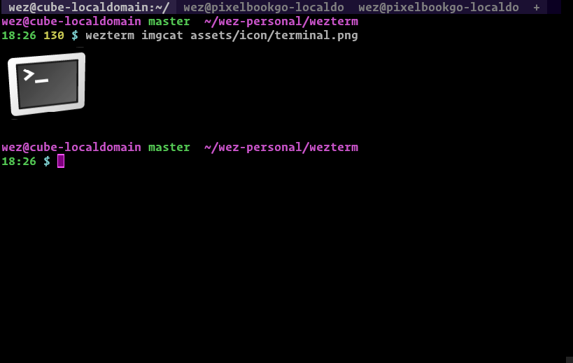

## iTerm Image Protocol Support

wezterm implements support for the [iTerm2 inline images
protocol](https://iterm2.com/documentation-images.html) and provides a handy
`imgcat` subcommand to make it easy to try out.  Because the protocol is
just a protocol, wezterm's `imgcat` also renders images in iTerm2.

To render an image inline in your terminal:

```
$ wezterm imgcat /path/to/image.png
```




**Note that the image protocol isn't fully handled by multiplexer sessions
at this time**.


*Since: 20220319-142410-0fcdea07*

WezTerm supports an extension to the protocol; passing `doNotMoveCursor=1` as
an argument to the `File` escape sequence causes wezterm to not move the cursor
position after processing the image.

