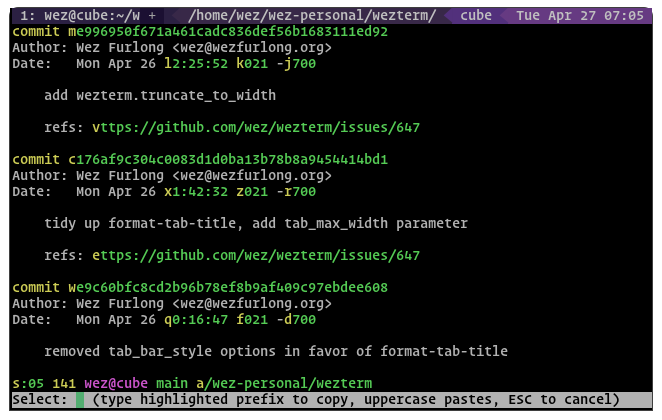

{{since('20210502-154244-3f7122cb')}}

Quick Select mode allows you to quickly highlight text that matches
commonly copied patterns, select a match by typing a one-or-two character
prefix and copy it to the clipboard.

The `QuickSelect` key assignment is used to enter quick select mode; it is
bound to `CTRL-SHIFT-SPACE` by default.

When quick select mode is activated, the terminal is searched for items that
match the patterns defined by the
[quick_select_patterns](config/lua/config/quick_select_patterns.md)
configuration combined with a default set of patterns that match things such as
URL and path fragments, git hashes, ip addresses and numbers.

Matches are highlighted and shown with a one or two character prefix derived
from the [quick_select_alphabet](config/lua/config/quick_select_alphabet.md)
configuration. The [colors](config/appearance.md#defining-your-own-colors)
of the highlighted text can be configured.

The bottom of the screen shows your input text along with a hint as to what to
do next; typing in a highlighted prefix will cause that text to be selected and
copied to the clipboard, and quick select mode will be cancelled.

Typing in the uppercase form of the prefix will copy AND paste the highlighted
text, and cancel quick select mode.

Pressing `ESCAPE` will cancel quick select mode.

