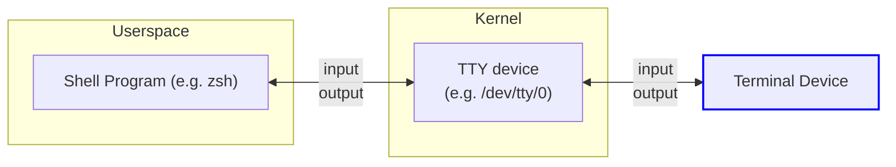
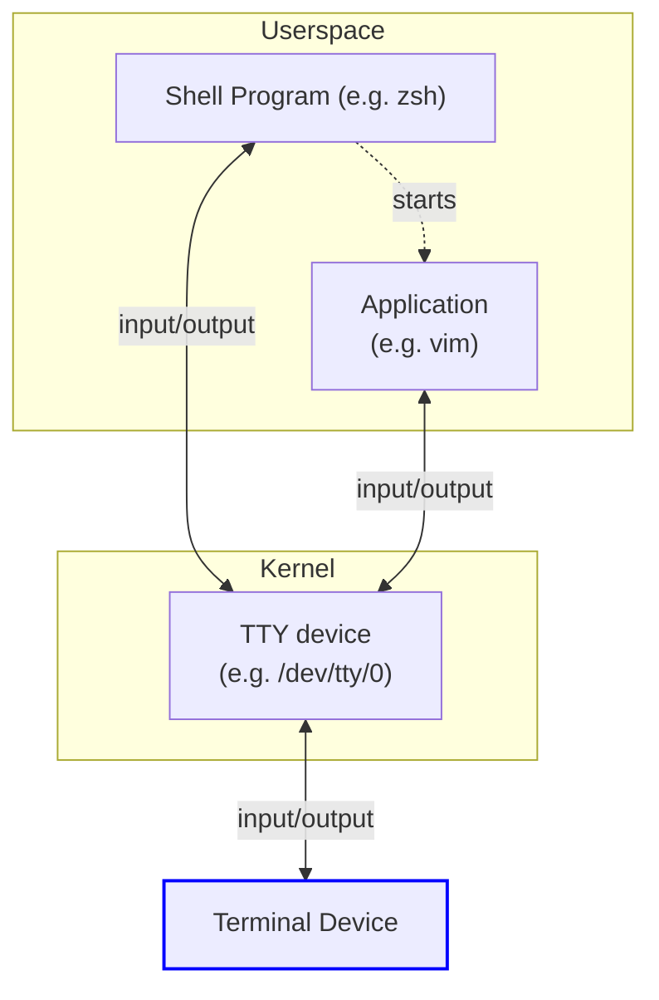
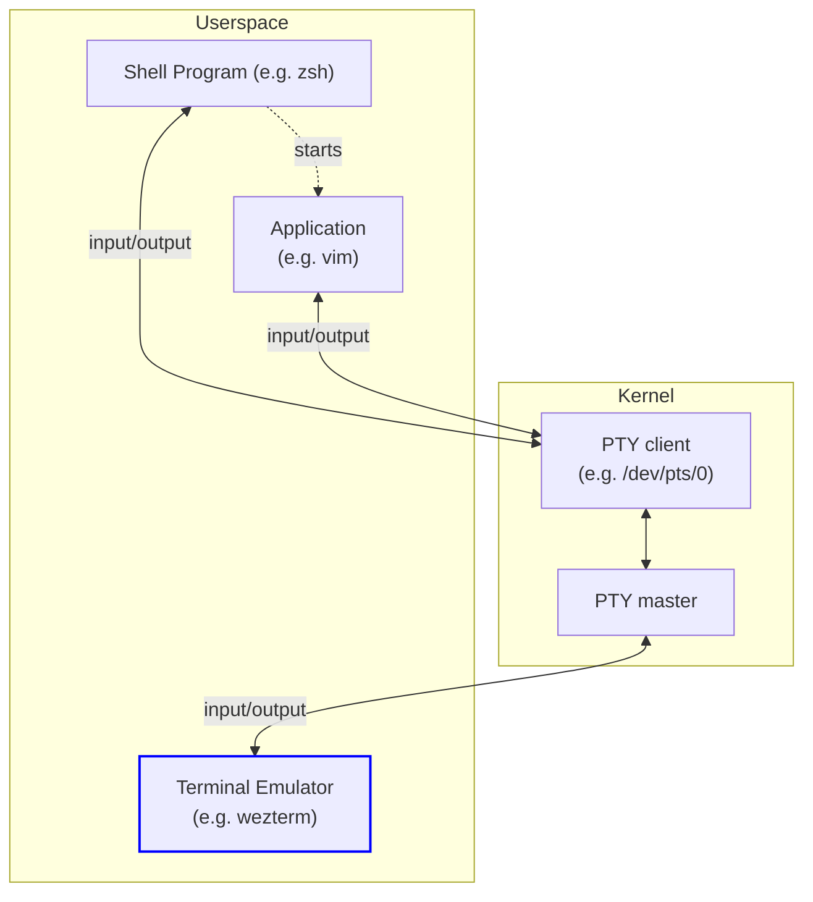

# What is a Terminal?

WezTerm is a Terminal Emulator, but what actually is that, and what is a PTY,
and what is a shell?  This section of the docs aims to summarize how these
things relate to each other to help clarify how things work.

This section tries to group concepts together to aid in understanding; it is not
intended to be a historically accurate chronology of the development of
terminals!

## Terminal

A computer terminal is a device that can be used for entering data into (input)
and presenting data from (output) a computer system.

Early terminals were very limited devices with basic keyboard data entry and
that would print the output onto paper. These devices communicated with the computer
system using a simple serial data connection.

That early heritage strongly influences the way that terminals are integrated
even in modern operating systems.

On unix operating systems, the kernel has a subsystem for managing *Terminal
TeletYpes* (TTYs) which is essentially a stream of input data, a stream of
output data, and some flow control and signal/interrupt management.  A TTY is
typically strongly associated with a physical serial communication device
installed in the system.

The kernel doesn't know any details of the connected device as there isn't
a defined way for it to do that; it only knows how to transmit data over that
serial line.

To accommodate this the TTY interface in the kernel allows for some basic
stream operations such as line-buffering and canonicalization of unix newlines
to carriage-return-line-feed as was needed for printer style output to
correctly move to the first column and move down a line.

## Shell

The Terminal and TTY interface are essentially low-level hardware
specifications for moving bytes around. On their own they don't provide any
pre-defined function on the connected computer system. For them to do something
there needs to be a program that can interpret the input and produce some
output.

That program is a shell program, such as [zsh](https://www.zsh.org/) or
[bash](https://www.gnu.org/software/bash/). Shell programs provide the user
with an interactive way to navigate the computer system and launch other
programs.

A shell indirectly communicates with the terminal via the TTY interface to the
kernel, which manages the actual communication with the terminal.

Again, the TTY interface doesn't provide a way for the shell program to know
what kind of terminal is attached, which sounds awkward. How is that managed?

## ANSI and ECMA-48

You've probably heard talk of *ANSI escape sequences* in the context of the
terminal, what are they?

The various terminal devices typically used
[ASCII](https://en.wikipedia.org/wiki/ASCII) to represent English text and then
a range of special byte sequences to control things like bold text.  Different
vendors may have selected different byte sequences for the same concept.

[ANSI](https://www.ansi.org/) is the American National Standards Institute and
is organizational body that works to create standards that make it
(theoretically!) easier to interoperate across different implementations of
things.

One product of ANSI is `X3.64` with the aim of replacing vendor-specific codes
in terminals and related computer equipment.

You can read more about [ANSI escape codes on Wikipedia](https://en.wikipedia.org/wiki/ANSI_escape_code).

It's not free to read the ANSI specification itself, but that same
specification was also published by ECMA (the European Computer Manufacturers
Association) as the freely available
[ECMA-48](https://www.ecma-international.org/publications-and-standards/standards/ecma-48/)

## Terminfo and termcap

Even though ANSI/ECMA provided information on standardizing communication,
there are devices that either pre-date the standards or that aren't fully
comformant, or that have more flexibility than the standards could foresee.

A database of terminal capabilities (termcap) was created that is essentially a
mapping of the kind of function (eg: "switch to bold rendering") to the
associated set of bytes that need to be sent to the terminal in order to
trigger that function.

Later, as the set of functions expanded, *terminfo* was developed as a successor
to termcap, which is more extensible.

These databases are consumed by applications using libraries such as
[curses](https://en.wikipedia.org/wiki/Curses_%28programming_library%29) and
its successors.

The way that they work is that the administrator of the system would define
the `TERM` environment variable to the name of the appropriate entry in the
terminal database as part of configuring the terminal and shell on the system.

The value of the `TERM` environment variable would then be used to resolve
the data from the terminal database by the library linked into the shell
so that it could produce appropriately formatted output.

## Running other programs

When a shell spawns a child process it passes to it the input/output streams
associated with the TTY and allows it to run.  The shell is not involved in the
transfer of data between the spawned program and the TTY; that program is
directly sending data to the TTY interface and the kernel then sends it on to
the attached hardware.

That means that any program that wants to produce nicely formatted information
on the associated terminal also needs to respect the setting of `TERM` and use
an appropriate library to resolve the correct escape sequences.

## What about stdin, stdout and stderr?

The unix environment defines the standard input/output streams and maps them to
specific file descriptors.

The shell program is started up with `stdin` assigned to the input stream from
the associated TTY and both `stdout` AND `stderr` are assigned to the output
stream.  `stderr` is a duplicate of the `stdout` stream, and writing to either
of them will send data to the terminal output.

The terminal only has a single stream of output data. As far as it is
concerned, `stdout` and `stderr` do not exist, there is only "output".

## Foreground process

Seeing the above diagram, you might wonder how the input/output is kept
straight when there are multiple programs that are consuming/producing it.

There is no firm enforcement of who gets to read/write to the TTY data streams,
and it's largely a cooperative effort. Usually, only a single program at a time
is actively doing something to the output, but it is easy to produce a garbled
mess by running multiple programs at once using the `&` background operator
available in many shell programs.

Some shells have job control concept that allows informing the kernel which
process is considered to be the active one; that helps when delivering
interrupt signals, but doesn't really do anything with the output.

## Signals

It is common to use `CTRL-C` to generate an interrupt signal, how does that work?

The TTY layer in the kernel is configured, usually via the `stty` utility, to
interpret the byte sequence that corresponds to `CTRL-C` (`0x03`) as an interrupt
signal. When the input stream matches the configured value, rather than propagating
that byte the kernel will instead translate it to `SIGINT` and deliver that
signal to the foreground process that is associated with the TTY.

The shell typically registers a `SIGINT` handler that clears the current line
of input, but keeps running. When the shell spawns a child process, it
starts it with the `SIGINT` handler set to the default behavior of
terminating the program, and then makes that child process the foreground
process. Then it will go to sleep waiting for the child to terminate.

When you subsequently hit `CTRL-C`, the kernel will send `SIGINT` to that child
foreground process which will then terminate and cause the shell to wake up
and continue.

If your shell supports job control, the suspend signal that is typically
associated with `CTRL-Z` will cause the foreground process to suspend which
in turn will wakeup the shell in a similar way to that of the child getting
terminated, but it can tell that it was suspended rather than terminated.

## Terminal Emulators and PTYs

As computer systems got more sophisticated and evolved to desktop environments
with multiple windows it was desirable to move the terminal into a window on
the desktop and it became necessary to expand the interface to allow for a TTY
that wasn't strongly coupled with a physical communication device, and to
provide a mechanism for communicating the window size changing.

The *Pseudo Terminal teletYpe* (PTY) is that evolution of the TTY interface; it
allows a userspace application to define additional virtual TTY interfaces as
needed.

A PTY has a controller side and a client side (the unfortunate legacy
terminology for those is *master* and *slave*, respectively), with the controller
side allowing for passing information about the window size, and the client side
essentially just being the I/O stream.

A *Terminal Emulator* is a program that creates a PTY and then spawns a child
program (typically a shell program) into that PTY, passing it the client-side
of the PTY.

The Terminal Emulator then reads the output from the client-side and interprets
the escape sequences to produce a display, and decodes keyboard/mouse input
from the windowing environment and encodes it as escape sequences to send to
the running program ([See keyboard encoding](config/key-encoding.md)) thereby
emulating in software the behavior of the classic hardware terminal devices.

## Windows and ConPTY

So far we've been talking about the architecture of UNIX systems, how does
Windows compare/relate to this?

While Windows has had the classic "dosbox" as an analogy of the unix terminal
emulator, the way it works is so fundamentally different from the unix approach
that it has caused headaches for portable software.

There was no PTY equivalent and the terminal emulation was closed off and
restricted to that provided by the system.  Some enterprising developers were
able to build terminal emulators that worked a little more like the unix
equivalents with clever tricks that were essentially screen-scraping, but there
were many cases that got in the way of a perfect experience.

In relatively recent times, [Windows grew support for
ConPTY](https://devblogs.microsoft.com/commandline/windows-command-line-introducing-the-windows-pseudo-console-conpty/)
which has opened things up a great deal for terminal emulation. The linked
article explains in detail how ConPTY works, so I'm only going to summarize the
main points here:

When running on Windows with ConPTY, an additional helper program (for wezterm,
that helper is typically named `openconsole.exe`, but in some circumstances it
may be `conhost.exe`) is spawned to help manage the PTY.

The purpose of this helper process is to translate escape sequences into the
native windows equivalent requests and send them to the window console driver.

Because Windows needs to have backwards compatibility with native windows
programs that use traditional windows console APIs, the ConPTY PTY
implementation is much more complex than the unix PTY/TTY kernel layer, and is
essentially its own terminal emulator sitting in between the terminal emulator
perceived by the user, and the application(s) that it has spawned inside.

The result of this is pretty good, but still has a few edge cases where the
ConPTY layer has some surprising behavior. I expect this to improve over time,
but what it means for wezterm users is that they may wish to bypass ConPTY in
some cases by using `wezterm ssh` to directly communicate with a "real" unix
pty either on a remote system or inside a WSL or VM running on the local
machine.
